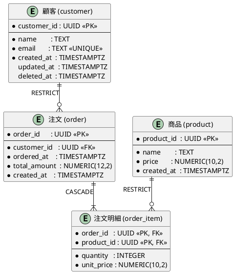

# データモデル設計スキル

PostgreSQLを対象に、T字形ER技法による概念・論理設計と、Expand & Contractパターンによる
安全なスキーマ進化を組み合わせて実践する。PK・FK・CASCADE制約の正確な設計も行う。

---

## 使用する2つの手法

### T字形ER技法（佐藤正美）

業務データを「リソース系」と「イベント系」に分類してERモデルを設計する手法。
単なる技術的なテーブル分割ではなく、業務の実態を正確にモデルに反映させることが目的。

**エンティティの分類**

| 種類 | 意味 | 典型例 |
|------|------|--------|
| リソース系（R） | 業務上管理される「もの」。比較的変化しない | 顧客、商品、従業員、拠点、部署 |
| イベント系（E） | 業務活動の発生を記録する「こと」。時系列に蓄積される | 注文、支払、入庫、出荷、契約 |

リソース系とイベント系の見極めが設計の根幹。「削除されうるか」「時系列に増えるか」を問うと判断しやすい。

**設計の進め方**

1. **業務分析** — 「誰が・何を・いつ・どうする」を業務フローとして整理する
2. **リソース抽出** — 業務で管理・参照される「もの」を列挙する
3. **イベント抽出** — 業務で発生・記録される「こと」を列挙し、どのリソースと結びつくかを明示する
4. **関係定義** — エンティティ間のカーディナリティ（1:1, 1:N, M:N）を決定する。M:Nは必ず中間テーブルで解消する
5. **属性定義** — 各エンティティが持つべき属性を洗い出す。「このエンティティの何を知りたいか」で考える
6. **正規化** — 第3正規形を基本とし、パフォーマンス上の理由がある場合のみ非正規化を検討する（理由を設計書に明記）

**命名規則**

- テーブル名：業務用語に忠実な単数形の英語スネークケース（例: `customer`, `purchase_order`）
- 主キー：`{テーブル名}_id`（例: `customer_id`）
- 外部キー：参照先の主キー名をそのまま使う（例: `customer_id`）
- 中間テーブル：`{テーブルA}_{テーブルB}`（例: `order_item`）
- タイムスタンプ：`created_at`, `updated_at`, `deleted_at` で統一

---

### Expand & Contract パターン

既存スキーマを変更する際に、ダウンタイムなしで安全にマイグレーションするための3フェーズ手法。
各フェーズは独立してデプロイ可能であることが必須条件。

```
現状
 │
 ▼
[Phase 1: Expand]   新しいカラム・テーブルを追加。古い要素はそのまま残す。
                    アプリは新旧両方に書き込む。
 │
 ▼
[Phase 2: Migrate]  旧データを新スキーマへ移行するバッチを実行。
                    アプリは徐々に新スキーマを参照するよう切り替える。
 │
 ▼
[Phase 3: Contract] 旧カラム・テーブルを削除。
                    アプリは新スキーマのみを使用している状態。
 │
 ▼
新状態
```

**各フェーズの設計原則**

| フェーズ | DDLの特徴 | 注意点 |
|---------|-----------|--------|
| Expand | `ALTER TABLE ADD COLUMN` / `CREATE TABLE` | 新カラムは `DEFAULT` 値か `NULL` 許容にする。NOT NULL + DEFAULT なしは即時適用できない |
| Migrate | `UPDATE` / `INSERT INTO ... SELECT` | 大量データは `LIMIT` を使ってバッチ処理。ロングトランザクション回避 |
| Contract | `ALTER TABLE DROP COLUMN` / `DROP TABLE` | アプリのデプロイが完全に切り替わってから実行。ロールバック不能 |

---

## 制約設計（PK / FK / CASCADE）

制約はDBレベルでデータ整合性を担保する最後の砦。アプリに任せず、できる限りDB側で宣言する。

### Primary Key（主キー）

```sql
-- サロゲートキー（推奨デフォルト）: ランダムUUID
customer_id UUID PRIMARY KEY DEFAULT gen_random_uuid()

-- 順序が必要な場合: BIGSERIAL（自動インクリメント）
log_id BIGSERIAL PRIMARY KEY

-- 複合主キー（中間テーブルなど）
PRIMARY KEY (order_id, product_id)
```

**選択基準**

| ケース | 推奨型 | 理由 |
|--------|--------|------|
| デフォルト | `UUID` | 分散環境・外部露出に安全、推測不能 |
| 順序が必要・パーティション対象 | `BIGSERIAL` | ソート・レンジ検索に有利 |
| 中間テーブル | 複合PK | 両方の外部キーを組み合わせた自然なPK |

### Foreign Key（外部キー）

```sql
-- 基本形: 明示的に制約名を付ける（エラー特定が容易になる）
CONSTRAINT fk_order_customer
    FOREIGN KEY (customer_id)
    REFERENCES customer (customer_id)
    ON DELETE RESTRICT
    ON UPDATE CASCADE
```

**CASCADE オプションの選択指針**

| オプション | 動作 | 使いどころ |
|-----------|------|-----------|
| `RESTRICT` | 参照先が存在する限り削除・更新を拒否（デフォルト推奨） | リソース系→イベント系のほとんどのケース。誤削除を防ぐ |
| `CASCADE` | 参照先の削除・更新に追随して削除・更新される | 明確な「所有」関係がある場合（例: 注文が消えたら注文明細も消す） |
| `SET NULL` | 参照先が消えたら外部キーをNULLにする | 任意の関連（担当者が退職しても案件は残したい、など） |
| `SET DEFAULT` | 参照先が消えたらデフォルト値をセット | デフォルトの代替リソースが存在する場合 |
| `NO ACTION` | トランザクション終了時にチェック（RESTRICTとほぼ同じ） | 通常はRESTRICTを使う |

**ON DELETE の設計判断フロー**

```
参照元レコードは参照先なしに存在できるか？
  └─ いいえ → CASCADE（所有関係）または RESTRICT（独立して管理）
      └─ 参照先が消えたら参照元も不要か？
            ├─ はい → CASCADE
            └─ いいえ → RESTRICT（削除前に参照元を先に処理する運用）
  └─ はい（参照先は任意）→ SET NULL
```

**ON UPDATE**
- 参照先の主キーを変更するケースは稀だが、`ON UPDATE CASCADE` を明示しておくと安全。
- UUIDサロゲートキーを使う場合、主キーが変わることはほぼないため実質的な影響はない。

**例: 代表的なパターン**

```sql
-- パターン1: リソース → イベント（RESTRICT）
-- 顧客が存在する限り注文は削除できない
CONSTRAINT fk_order_customer
    FOREIGN KEY (customer_id) REFERENCES customer(customer_id)
    ON DELETE RESTRICT
    ON UPDATE CASCADE,

-- パターン2: 親 → 子（CASCADE）
-- 注文が消えたら注文明細も消える（所有関係）
CONSTRAINT fk_order_item_order
    FOREIGN KEY (order_id) REFERENCES "order"(order_id)
    ON DELETE CASCADE
    ON UPDATE CASCADE,

-- パターン3: 任意の関連（SET NULL）
-- 担当者が削除されてもタスクは残す
CONSTRAINT fk_task_assignee
    FOREIGN KEY (assignee_id) REFERENCES employee(employee_id)
    ON DELETE SET NULL
    ON UPDATE CASCADE,

-- パターン4: 中間テーブルの複合FK
-- 片方が消えたら中間テーブルも消す
CONSTRAINT fk_product_tag_product
    FOREIGN KEY (product_id) REFERENCES product(product_id)
    ON DELETE CASCADE
    ON UPDATE CASCADE,
CONSTRAINT fk_product_tag_tag
    FOREIGN KEY (tag_id) REFERENCES tag(tag_id)
    ON DELETE CASCADE
    ON UPDATE CASCADE
```

### その他の制約

```sql
-- NOT NULL: 業務上必須な属性には必ず付ける
name TEXT NOT NULL,

-- UNIQUE: 一意性が業務ルールである場合
email TEXT NOT NULL UNIQUE,
-- または複合UNIQUE
CONSTRAINT uq_user_tenant UNIQUE (email, tenant_id),

-- CHECK: 値の範囲・形式をDBで保証する
amount NUMERIC(12,2) NOT NULL CHECK (amount >= 0),
status TEXT NOT NULL CHECK (status IN ('draft', 'active', 'closed')),

-- DEFERRABLE: 同一トランザクション内で一時的に制約違反を許容（循環参照の解消など）
CONSTRAINT fk_xxx FOREIGN KEY (...) REFERENCES ...
    DEFERRABLE INITIALLY DEFERRED
```

---

## ワークフロー

最初に用途を確認する：**新規設計**か**既存スキーマの進化**か。両方の場合は新規設計を先に行い、その後マイグレーション計画を立てる。

### 新規データモデル設計

#### Step 1: 要件ヒアリング

以下を確認してから設計に入る：

- **対象業務** — どのドメインか（ECサイト、在庫管理、会計、予約管理 etc.）
- **主要な業務フロー** — 誰が・何を・どのように行うか
- **想定データ規模** — 主要テーブルの行数オーダー
- **パフォーマンス傾向** — 読み取り中心か、書き込み中心か

#### Step 2: T字形ER技法によるモデリング

1. リソース系エンティティを列挙し、主キーと主要属性を決める
2. イベント系エンティティを列挙し、どのリソースと結びつくかを明示する
3. M:N関係を中間テーブルで解消する
4. 第3正規形に正規化する
5. モデルをユーザーに説明し、業務の実態と合っているかを確認する

#### Step 3: 制約設計

各外部キーについて CASCADE オプションを明示的に決定する。「デフォルトのまま」にしない。設計書に選択理由も記載する。

#### Step 4: PostgreSQL 物理設計

- **主キー型** — UUID（デフォルト）or BIGSERIAL（順序必要時）
- **タイムスタンプ** — 必ず `TIMESTAMPTZ`
- **金額** — `NUMERIC(precision, scale)`（浮動小数点は使わない）
- **論理削除** — `deleted_at TIMESTAMPTZ`。物理削除と混在させない
- **インデックス** — 外部キー列には必ず作成。頻繁な検索列にも追加を検討
- **updated_at** — トリガーで自動更新するか、アプリ側でセットするか方針を決める

#### Step 5: 成果物を生成する

1. PlantUML ER図
2. PostgreSQL DDL（制約名・CASCADE付き）
3. Markdown設計書（FK設計の選択理由を含む）

---

### 既存スキーマの進化（Expand & Contract）

#### Step 1: 現状分析

- 既存のDDLまたはスキーマ情報を確認する
- 変更要件を整理する（追加・変更・削除したいもの）
- ダウンタイムの許容可否を確認する

#### Step 2: 変更の分類

| 変更の種類 | Expand & Contract 必要か |
|-----------|------------------------|
| カラム追加（NULL許容 or DEFAULT付き） | 不要（1フェーズで適用可能） |
| カラム追加（NOT NULL、DEFAULTなし） | 必要 |
| カラム削除 | 必要 |
| カラム名変更 | 必要（追加→移行→削除） |
| テーブル分割・統合 | 必要 |
| 型変更 | 必要 |
| FK追加 | 既存データが制約を満たすか先に確認 |

#### Step 3: Expand & Contract 計画立案

変更を3フェーズに分解し、各フェーズのDDLとアプリ側対応を明示する。

#### Step 4: 成果物を生成する

- フェーズ別DDL（制約名・CASCADE付き）
- ロールバック手順（Contractフェーズは原則ロールバック不能と明記）
- Before/After の PlantUML ER図
- Markdown設計書（変更差分・FK設計理由を含む）

---

## 成果物フォーマット

### PlantUML ER図



### PostgreSQL DDL

```sql
-- ============================================================
-- リソース系テーブル
-- ============================================================

CREATE TABLE customer (
    customer_id  UUID         NOT NULL DEFAULT gen_random_uuid(),
    name         TEXT         NOT NULL,
    email        TEXT         NOT NULL,
    created_at   TIMESTAMPTZ  NOT NULL DEFAULT now(),
    updated_at   TIMESTAMPTZ  NOT NULL DEFAULT now(),
    deleted_at   TIMESTAMPTZ,

    CONSTRAINT pk_customer        PRIMARY KEY (customer_id),
    CONSTRAINT uq_customer_email  UNIQUE (email)
);

CREATE TABLE product (
    product_id   UUID          NOT NULL DEFAULT gen_random_uuid(),
    name         TEXT          NOT NULL,
    price        NUMERIC(10,2) NOT NULL CHECK (price >= 0),
    created_at   TIMESTAMPTZ   NOT NULL DEFAULT now(),
    updated_at   TIMESTAMPTZ   NOT NULL DEFAULT now(),

    CONSTRAINT pk_product PRIMARY KEY (product_id)
);

-- ============================================================
-- イベント系テーブル
-- ============================================================

CREATE TABLE "order" (
    order_id      UUID          NOT NULL DEFAULT gen_random_uuid(),
    customer_id   UUID          NOT NULL,
    ordered_at    TIMESTAMPTZ   NOT NULL DEFAULT now(),
    total_amount  NUMERIC(12,2) NOT NULL CHECK (total_amount >= 0),
    created_at    TIMESTAMPTZ   NOT NULL DEFAULT now(),

    CONSTRAINT pk_order          PRIMARY KEY (order_id),
    CONSTRAINT fk_order_customer FOREIGN KEY (customer_id)
        REFERENCES customer (customer_id)
        ON DELETE RESTRICT   -- 顧客が存在する限り注文は削除不可
        ON UPDATE CASCADE
);

-- 中間テーブル（M:N解消）
CREATE TABLE order_item (
    order_id    UUID          NOT NULL,
    product_id  UUID          NOT NULL,
    quantity    INTEGER       NOT NULL CHECK (quantity > 0),
    unit_price  NUMERIC(10,2) NOT NULL CHECK (unit_price >= 0),

    CONSTRAINT pk_order_item         PRIMARY KEY (order_id, product_id),
    CONSTRAINT fk_order_item_order   FOREIGN KEY (order_id)
        REFERENCES "order" (order_id)
        ON DELETE CASCADE    -- 注文が消えたら明細も消える（所有関係）
        ON UPDATE CASCADE,
    CONSTRAINT fk_order_item_product FOREIGN KEY (product_id)
        REFERENCES product (product_id)
        ON DELETE RESTRICT   -- 商品が存在する限り明細は削除不可
        ON UPDATE CASCADE
);

-- ============================================================
-- インデックス（外部キー列には必ず作成）
-- ============================================================

CREATE INDEX idx_order_customer_id ON "order"      (customer_id);
CREATE INDEX idx_order_ordered_at  ON "order"      (ordered_at DESC);
CREATE INDEX idx_order_item_product ON order_item  (product_id);
```

### Expand & Contract フェーズ別DDL

```sql
-- ============================================================
-- Phase 1: Expand（拡張）
-- デプロイタイミング: アプリv2リリース前
-- ロールバック: 可能（ADD COLUMN の逆は DROP COLUMN）
-- ============================================================
ALTER TABLE customer
    ADD COLUMN phone TEXT;  -- NULL許容で追加（既存レコードに影響なし）

-- 新しい外部キーを追加する場合: 既存データが制約を満たすか先に検証
-- SELECT count(*) FROM child WHERE parent_id NOT IN (SELECT id FROM parent);
ALTER TABLE "order"
    ADD COLUMN coupon_id UUID,
    ADD CONSTRAINT fk_order_coupon FOREIGN KEY (coupon_id)
        REFERENCES coupon (coupon_id)
        ON DELETE SET NULL   -- クーポン削除後も注文は残す
        ON UPDATE CASCADE;

-- ============================================================
-- Phase 2: Migrate（移行）
-- デプロイタイミング: アプリv2リリース後
-- 大量データは LIMIT + OFFSET でバッチ処理
-- ============================================================
UPDATE customer
SET phone = legacy_contacts.phone
FROM legacy_contacts
WHERE customer.customer_id = legacy_contacts.customer_id
  AND customer.phone IS NULL;

-- ============================================================
-- Phase 3: Contract（縮退）
-- デプロイタイミング: アプリv3リリース・動作確認後
-- ⚠️ ロールバック不可。実行前に必ずバックアップを取ること
-- ============================================================
-- 制約を先に外してからカラム削除
ALTER TABLE customer
    ALTER COLUMN phone SET NOT NULL;  -- データ移行完了後にNOT NULL化

DROP TABLE legacy_contacts;
```

### Markdown設計書

```markdown
# テーブル設計書

**作成日**: YYYY-MM-DD
**対象DB**: PostgreSQL
**設計手法**: T字形ER技法（佐藤正美）

---

## エンティティ一覧

| テーブル名 | 和名 | 分類 | 説明 |
|-----------|------|------|------|
| customer | 顧客 | リソース系 | ... |
| product | 商品 | リソース系 | ... |
| order | 注文 | イベント系 | ... |
| order_item | 注文明細 | 中間テーブル | ... |

---

## テーブル定義: customer（顧客）

**分類**: リソース系
**説明**: ...

### カラム定義

| カラム名 | 型 | NOT NULL | デフォルト | 説明 |
|---------|-----|---------|-----------|------|
| customer_id | UUID | ✓ | gen_random_uuid() | 主キー |
| name | TEXT | ✓ | — | 顧客名 |
| email | TEXT | ✓ | — | メールアドレス |
| created_at | TIMESTAMPTZ | ✓ | now() | 作成日時 |
| updated_at | TIMESTAMPTZ | ✓ | now() | 更新日時 |
| deleted_at | TIMESTAMPTZ | — | — | 論理削除日時 |

### 制約

| 制約名 | 種類 | 対象カラム | 内容 |
|-------|------|-----------|------|
| pk_customer | PRIMARY KEY | customer_id | — |
| uq_customer_email | UNIQUE | email | メール重複防止 |

### インデックス

| インデックス名 | カラム | 種類 | 目的 |
|--------------|--------|------|------|
| pk_customer | customer_id | PRIMARY KEY | — |
| uq_customer_email | email | UNIQUE | — |

### 外部キー設計

| 制約名 | カラム | 参照先 | ON DELETE | ON UPDATE | 選択理由 |
|-------|--------|--------|-----------|-----------|---------|
| fk_order_customer | customer_id | customer | RESTRICT | CASCADE | 顧客が存在する限り注文は削除させない業務ルール |

---

## 変更履歴（Expand & Contract 適用時）

| バージョン | フェーズ | 変更内容 | 実施日 |
|-----------|---------|---------|--------|
| v2 | Expand | customer.phone 追加（NULL許容） | YYYY-MM-DD |
| v2 | Migrate | phone データ移行 | YYYY-MM-DD |
| v3 | Contract | legacy_contacts 削除、phone NOT NULL化 | YYYY-MM-DD |
```

---

## 設計チェックリスト

**T字形ER技法**
- [ ] 全テーブルをリソース系・イベント系・中間テーブルのいずれかに分類できている
- [ ] M:N関係は全て中間テーブルで解消されている
- [ ] 第3正規形に正規化されている（非正規化の場合は設計書に理由を記載）
- [ ] 命名規則が統一されている

**PK / FK / CASCADE**
- [ ] 全テーブルに明示的な PRIMARY KEY 制約がある（制約名付き）
- [ ] 全外部キーに明示的な FOREIGN KEY 制約がある（制約名付き）
- [ ] 全外部キーの ON DELETE / ON UPDATE を意図的に選択している（デフォルト任せにしていない）
- [ ] CASCADE を選んだ場合、所有関係であることを確認している
- [ ] RESTRICT を選んだ場合、削除前の参照元処理をアプリ側で担保している
- [ ] SET NULL を選んだ場合、外部キー列が NULL 許容になっている
- [ ] 外部キー列全てにインデックスが作成されている

**PostgreSQL物理設計**
- [ ] タイムスタンプは全て `TIMESTAMPTZ` を使用している
- [ ] 金額・数量に浮動小数点型（FLOAT/REAL）を使っていない
- [ ] CHECK 制約で値の範囲・列挙値を保護している
- [ ] 論理削除を使う場合、`deleted_at` の扱いをアプリ側で合意している

**Expand & Contract**
- [ ] 各フェーズが独立してデプロイ可能になっている
- [ ] Expandフェーズの新カラムは `NULL` 許容または `DEFAULT` 付きになっている
- [ ] FK追加前に既存データが制約を満たすことを検証するクエリを記載している
- [ ] Contractフェーズはロールバック不可と明記している
