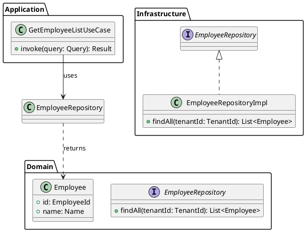
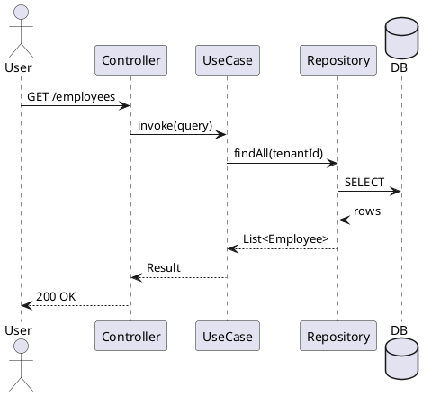
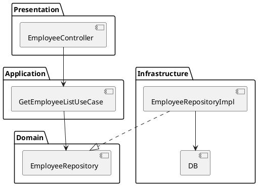
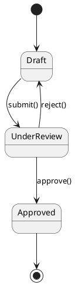
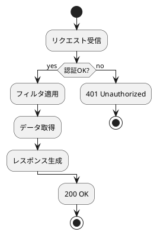

```plantuml
@startuml
...
@enduml
```

# Code Structure — PlantUMLで図を生成

## 概要

コードや説明からPlantUML形式の図を生成する。
PRレビュー・設計議論・仕様確認など、全体像を掴みたいあらゆる場面で使う。

## Step 1: 図の種類を判定

ユーザーの意図から自動判定する。曖昧な場合は確認せず最適なものを選ぶ。

| 状況 | 図の種類 |
|------|---------|
| クラス・型・継承関係を見たい | クラス図 |
| APIコール・処理の流れを見たい | シーケンス図 |
| モジュール・レイヤー構成を見たい | コンポーネント図 |
| 状態遷移を見たい | ステート図 |
| 処理フロー・分岐を見たい | アクティビティ図 |
| ER図・データ構造を見たい | ER図（クラス図で代用） |

## Step 2: ソース情報の取得

**コードから生成する場合**
```bash
gh pr diff <PR番号> --name-only   # PR変更ファイル一覧
git diff origin/main --name-only  # ブランチ差分
```
対象ファイルをReadで読み込む（`.kt`, `.ts`, `.tsx`, `.java`）。

**説明から生成する場合**
ユーザーの説明をそのままインプットとして図を生成する。

## Step 3: PlantUMLを生成・出力

````

````

---

## 図の種類別テンプレート

### クラス図



**よく使う記法**
| 記法 | 意味 |
|------|------|
| `<\|--` | 継承 |
| `<\|..` | 実装 |
| `-->` | 依存 |
| `*--` | コンポジション |
| `<<interface>>` | ステレオタイプ |

---

### シーケンス図



---

### コンポーネント図



---

### ステート図



---

### アクティビティ図



---

## 注意事項

- 要素が多い場合（クラス20超など）は変更ファイルに絞るか図を分割する
- テストクラスは原則除外
- 図の後にレイヤー構成などの補足コメントを添えると親切
