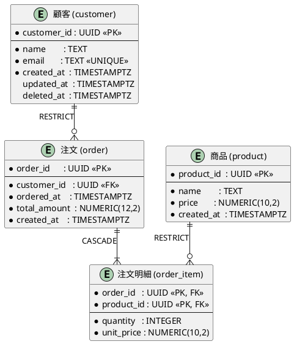

# 成果物フォーマット テンプレート集

## PlantUML ER図



---

## PostgreSQL DDL

```sql
-- ============================================================
-- リソース系テーブル
-- ============================================================

CREATE TABLE customer (
    customer_id  UUID         NOT NULL DEFAULT gen_random_uuid(),
    name         TEXT         NOT NULL,
    email        TEXT         NOT NULL,
    created_at   TIMESTAMPTZ  NOT NULL DEFAULT now(),
    updated_at   TIMESTAMPTZ  NOT NULL DEFAULT now(),
    deleted_at   TIMESTAMPTZ,

    CONSTRAINT pk_customer        PRIMARY KEY (customer_id),
    CONSTRAINT uq_customer_email  UNIQUE (email)
);

CREATE TABLE product (
    product_id   UUID          NOT NULL DEFAULT gen_random_uuid(),
    name         TEXT          NOT NULL,
    price        NUMERIC(10,2) NOT NULL CHECK (price >= 0),
    created_at   TIMESTAMPTZ   NOT NULL DEFAULT now(),
    updated_at   TIMESTAMPTZ   NOT NULL DEFAULT now(),

    CONSTRAINT pk_product PRIMARY KEY (product_id)
);

-- ============================================================
-- イベント系テーブル
-- ============================================================

CREATE TABLE "order" (
    order_id      UUID          NOT NULL DEFAULT gen_random_uuid(),
    customer_id   UUID          NOT NULL,
    ordered_at    TIMESTAMPTZ   NOT NULL DEFAULT now(),
    total_amount  NUMERIC(12,2) NOT NULL CHECK (total_amount >= 0),
    created_at    TIMESTAMPTZ   NOT NULL DEFAULT now(),

    CONSTRAINT pk_order          PRIMARY KEY (order_id),
    CONSTRAINT fk_order_customer FOREIGN KEY (customer_id)
        REFERENCES customer (customer_id)
        ON DELETE RESTRICT   -- 顧客が存在する限り注文は削除不可
        ON UPDATE CASCADE
);

-- 中間テーブル（M:N解消）
CREATE TABLE order_item (
    order_id    UUID          NOT NULL,
    product_id  UUID          NOT NULL,
    quantity    INTEGER       NOT NULL CHECK (quantity > 0),
    unit_price  NUMERIC(10,2) NOT NULL CHECK (unit_price >= 0),

    CONSTRAINT pk_order_item         PRIMARY KEY (order_id, product_id),
    CONSTRAINT fk_order_item_order   FOREIGN KEY (order_id)
        REFERENCES "order" (order_id)
        ON DELETE CASCADE    -- 注文が消えたら明細も消える（所有関係）
        ON UPDATE CASCADE,
    CONSTRAINT fk_order_item_product FOREIGN KEY (product_id)
        REFERENCES product (product_id)
        ON DELETE RESTRICT   -- 商品が存在する限り明細は削除不可
        ON UPDATE CASCADE
);

-- ============================================================
-- インデックス（外部キー列には必ず作成）
-- ============================================================

CREATE INDEX idx_order_customer_id ON "order"      (customer_id);
CREATE INDEX idx_order_ordered_at  ON "order"      (ordered_at DESC);
CREATE INDEX idx_order_item_product ON order_item  (product_id);
```

---

## Expand & Contract フェーズ別DDL

```sql
-- ============================================================
-- Phase 1: Expand（拡張）
-- デプロイタイミング: アプリv2リリース前
-- ロールバック: 可能（ADD COLUMN の逆は DROP COLUMN）
-- ============================================================
ALTER TABLE customer
    ADD COLUMN phone TEXT;  -- NULL許容で追加（既存レコードに影響なし）

-- 新しい外部キーを追加する場合: 既存データが制約を満たすか先に検証
-- SELECT count(*) FROM child WHERE parent_id NOT IN (SELECT id FROM parent);
ALTER TABLE "order"
    ADD COLUMN coupon_id UUID,
    ADD CONSTRAINT fk_order_coupon FOREIGN KEY (coupon_id)
        REFERENCES coupon (coupon_id)
        ON DELETE SET NULL   -- クーポン削除後も注文は残す
        ON UPDATE CASCADE;

-- ============================================================
-- Phase 2: Migrate（移行）
-- デプロイタイミング: アプリv2リリース後
-- 大量データは LIMIT + OFFSET でバッチ処理
-- ============================================================
UPDATE customer
SET phone = legacy_contacts.phone
FROM legacy_contacts
WHERE customer.customer_id = legacy_contacts.customer_id
  AND customer.phone IS NULL;

-- ============================================================
-- Phase 3: Contract（縮退）
-- デプロイタイミング: アプリv3リリース・動作確認後
-- ⚠️ ロールバック不可。実行前に必ずバックアップを取ること
-- ============================================================
ALTER TABLE customer
    ALTER COLUMN phone SET NOT NULL;  -- データ移行完了後にNOT NULL化

DROP TABLE legacy_contacts;
```

---

## Markdown設計書

```markdown
# テーブル設計書

**作成日**: YYYY-MM-DD
**対象DB**: PostgreSQL
**設計手法**: T字形ER技法（佐藤正美）

---

## エンティティ一覧

| テーブル名 | 和名 | 分類 | 説明 |
|-----------|------|------|------|
| customer | 顧客 | リソース系 | ... |
| product | 商品 | リソース系 | ... |
| order | 注文 | イベント系 | ... |
| order_item | 注文明細 | 中間テーブル | ... |

---

## テーブル定義: customer（顧客）

**分類**: リソース系
**説明**: ...

### カラム定義

| カラム名 | 型 | NOT NULL | デフォルト | 説明 |
|---------|-----|---------|-----------|------|
| customer_id | UUID | ✓ | gen_random_uuid() | 主キー |
| name | TEXT | ✓ | — | 顧客名 |
| email | TEXT | ✓ | — | メールアドレス |
| created_at | TIMESTAMPTZ | ✓ | now() | 作成日時 |
| updated_at | TIMESTAMPTZ | ✓ | now() | 更新日時 |
| deleted_at | TIMESTAMPTZ | — | — | 論理削除日時 |

### 制約

| 制約名 | 種類 | 対象カラム | 内容 |
|-------|------|-----------|------|
| pk_customer | PRIMARY KEY | customer_id | — |
| uq_customer_email | UNIQUE | email | メール重複防止 |

### インデックス

| インデックス名 | カラム | 種類 | 目的 |
|--------------|--------|------|------|
| pk_customer | customer_id | PRIMARY KEY | — |
| uq_customer_email | email | UNIQUE | — |

### 外部キー設計

| 制約名 | カラム | 参照先 | ON DELETE | ON UPDATE | 選択理由 |
|-------|--------|--------|-----------|-----------|---------|
| fk_order_customer | customer_id | customer | RESTRICT | CASCADE | 顧客が存在する限り注文は削除させない業務ルール |

---

## 変更履歴（Expand & Contract 適用時）

| バージョン | フェーズ | 変更内容 | 実施日 |
|-----------|---------|---------|--------|
| v2 | Expand | customer.phone 追加（NULL許容） | YYYY-MM-DD |
| v2 | Migrate | phone データ移行 | YYYY-MM-DD |
| v3 | Contract | legacy_contacts 削除、phone NOT NULL化 | YYYY-MM-DD |
```
