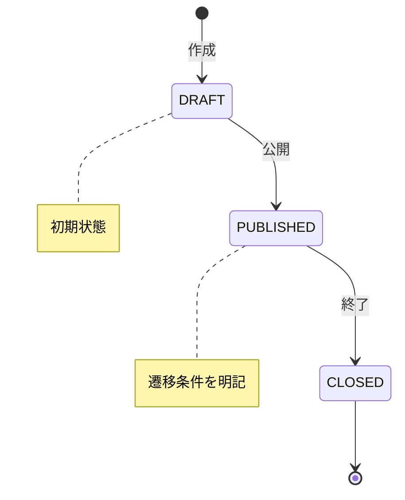
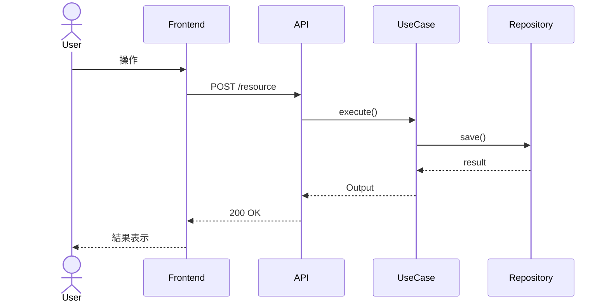

# 上位フロー（Epic Level）

Epic/USチケットから**設計→チケット分割**を行い、実装可能な粒度のチケットを生成する。

> **⚠️ 既存修正時のステップ実行ルール**
>
> 対象機能のコードが既に存在する場合（バグ修正・仕様変更・リファクタリング・機能拡張）でも、E1〜E4の各ステップを実行する。
> 各ステップには修正時の固有の目的がある。「既に実装済み」はスキップの理由にならない。
>
> | ステップ | 新規開発時の目的 | **修正時の目的** |
> |---------|---------------|----------------|
> | E1 | 要件把握・AC生成 | **既存ACと修正要件の差分分析**。現行ACのどこが変わるか特定し、修正後のACを生成（回帰テスト基準を含める） |
> | E2 | アーキテクチャ設計 | **影響波及分析と既存設計との整合性チェック**。修正が既存コードのどこに波及するか調査 |
> | E3 | チケット分割 | **修正スコープの分割**。複数箇所に跨る場合は安全なデプロイ単位に分割。単箇所でも「分割不要の確認と依存グラフの更新」として実行 |
> | E4 | 実装ループ | 通常通り |

## E1: Epic取得と全体像把握

### タスク性質判定（仕様投資レベルの決定）

チケットの内容から、タスクの性質を判定する。
判定結果は scratch.md と spec-draft.md に記録し、後続フェーズの実行戦略に反映する。

| 層 | 判定基準 | 仕様戦略 | AC詳細度 |
|---|---|---|---|
| **Tier 1: 一発OK** | CRUD、設定変更、既知パターン。変更ファイル3未満 | 最小限のAC。Examplesは正常系1行でOK | 低 |
| **Tier 2: イテレーション収束** | 複数コンポーネント、UI、分岐多い。変更ファイル3-15 | ACの精度に投資。Examples必須（正常系+境界値+異常系） | 高 |
| **Tier 3: イテレーション前提** | 既存統合深い、パフォーマンス、ドメイン知識必要。変更ファイル15+ or 不明 | スコープを小さく切って高速ループ。ACは段階的に育てる | 段階的 |

**後続フェーズへの影響**:

| 後続フェーズ | Tier 1 | Tier 2 | Tier 3 |
|---|---|---|---|
| E2（設計） | スキップ可 | 通常実行 | 通常実行 + 分割検討 |
| E3（分割） | 分割なし | 必要に応じて | 必ず小さく分割 |
| QG修正ループ | max 3 | max 5 | max 5 + 仕様への差分フィードバック |

**記録フォーマット** — scratch.md に追記:

```markdown
## タスク性質判定
- **Tier**: {1/2/3}
- **判定根拠**: {なぜこのTierか}
- **仕様戦略**: {AC詳細度の方針}
```

1. チケットの内容を確認: PRD / 要件 / A.C. / デザイン（Figma）/ 関連チケット
2. 仕様書ソースを検出（Notion URL、Obsidianパス、Figma URL、`docs/` 内のMarkdown）
3. **A.C.品質判定と補完**（`references/ac-guidelines.md` の基準に従う）:

### Step 1: 存在チェック

> **⚠️ チケット内容が不十分な場合は、Step 1 判定の前に Step 1a（周辺チケット参照）を実施する。**
> 「内容が不十分」とは：説明が3行未満 かつ ACなし かつ 仕様書リンクなし、の **AND条件** を満たす場合。

| チケット状態 | アクション |
|---|---|
| ACが存在する | → Step 2（フォーマット修正）へ |
| ACなし だが仕様書/PRDリンクあり | **仕様書→US+AC自動生成**を実行 → Step 2 へ |
| ACなし かつ 仕様書なし かつ 説明が十分 | **`sier-dev` スキルで要件定義書を生成**（`docs/01_requirements/要件定義書.md` に保存）→ 仕様書→US+AC自動生成 → Step 2 へ |
| ACなし かつ 仕様書なし かつ 説明が不十分（3行未満） | **→ Step 1a（周辺チケット参照）を実施** → コンテキスト補完後に上記ルールを再適用 |

### Step 1a: 周辺チケット参照（コンテキスト補完）

チケット本体の内容では何を作ればよいか判断できない場合に実施する。
**調査は1回の参照で打ち切る。不明点は Decision Record に残して先へ進む。**

| 参照順序 | 対象 | 確認内容 |
|---------|------|---------|
| 1 | **親チケット / Epic** | ビジネス目的・全体スコープ・背景・上位AC |
| 2 | **リンクされたチケット**（blocks / is blocked by） | 依存関係・前提条件・既実装の範囲 |

**チケット管理ツール別の取得方法:**

```bash
# Jira（jira-cli スキルを使用）
jira issue view EPIC-xxx      # 親Epic確認
jira issue view PARENT-xxx    # 親チケット確認

# GitHub Issues
gh issue view 123              # 親issueまたは関連issue確認

# Linear
# mcp__claude_ai_Linear__get_issue を使用

# Notion / その他
# チケット内のURLから notion-fetch 等を使用
```

収集結果は `scratch.md` の「コンテキスト収集ログ」セクションに記録してから Step 1 に戻る:

```markdown
## コンテキスト収集ログ（Step 1a）
- **参照したチケット**: {チケットID} — {タイトル}
- **判明したコンテキスト**: {ビジネス目的・スコープ等}
- **未解決事項**: {それでも不明な点} → Decision Record へ
```

### Step 2〜4: フォーマット修正・過不足分析・補完

**→ `references/ac-guidelines.md` の「A.C.過不足分析プロセス」（Step 1〜3）を実行する。**

プロセスの概要:
1. **フォーマット修正**: 箇条書き→GWT形式へのリライト、Examplesテーブル追加、抽象表現→具体値への置き換え
2. **過不足分析**: 7項目チェックリスト（具体性・テスト可能性・正常系網羅性・異常系・境界値・副作用・非機能要件）で網羅性検査
3. **自動補完**: 不足項目を仕様書/コードベース/ドメイン知識から補完。補完ACに `[補完]` マークを付与

分析・補完の結果は `spec-draft.md` に `ac-guidelines.md` 記載のフォーマットで品質レポートとして出力する。

### 仕様書→US+AC自動生成

`general-purpose` (sonnet) で以下を実行:
1. ソースドキュメントを取得・読み込み
2. アクター・機能要件・ビジネス価値を抽出
3. user-story形式（`{アクター}として、{目標}したい。なぜなら{理由}だからだ。`）でUS生成
4. 各USにGWT形式のACを付与
5. プロジェクトルートに `spec-draft.md` として保存（アクター一覧・依存関係マップ・未解決事項を含む）
6. 未解決事項をDecision Recordとして出力

### 各チケットのAC生成（SBE形式）

E2の設計と E3の分割結果に基づき、各チケットの受け入れ条件を生成する。

**→ `references/ac-guidelines.md` を読み込み、AC品質基準に準拠すること。**

ACは必ず **GWT + Examples（SBE形式）** で記述し、`ac-guidelines.md` の7項目チェックリスト（具体性・テスト可能性・正常系網羅性・異常系・境界値・副作用・非機能要件）を満たすこと。E1で補完済みのACがある場合はそれをベースにし、E2の設計情報で肉付けする。

#### spec.md の生成

プロジェクトルートに `spec.md` を作成。E1で `spec-draft.md` が存在する場合はそれをベースに肉付けする。

```markdown
# {Epic タイトル} - 仕様書

## 全体テスト戦略

- **チケット間の統合テスト**: {全チケットマージ後に確認すべき項目}
- **E&C安全性テスト**: {Expand状態で旧コードが動作することの確認方法}

---

## {EPIC-ID}-1: {タイトル}

**ストーリー:**
{アクター}として、{目標}したい。なぜなら{理由}だからだ。

**受け入れ条件:**

- [ ] **AC1: {条件のタイトル}**
  - **Given** {具体的なデータ値を含む前提条件}
  - **When** {具体的な操作}
  - **Then** {具体的な期待結果（APIレスポンス、UI状態変化等）}

  **Examples:**
  | 入力 | 初期状態 | 操作後 | 期待結果 |
  |------|---------|--------|---------|
  | {正常系} | ... | ... | ... |
  | {境界値} | ... | ... | ... |
  | {異常系} | ... | ... | ... |

**テストスコープ:**
- Unit: {対象}
- Integration: {対象}
- E2E: {対象、または「なし」}

---

## {EPIC-ID}-2: {タイトル}
...
```

#### 自己検証

- 全要件カバー / エッジケース考慮 / 既存影響把握 / スコープ外明記
- 全てOK → E4 へ
- 曖昧な点 → Decision Recordに「仮定」として記録し E4 へ

### E1完了後 advisor チェック（Tier 2/3 のみ）

> **⚠️ E2（アーキテクチャ設計）に進む前に、AC品質と仕様の妥当性を確認せよ。**

Tier 判定が **Tier 2 または Tier 3** の場合、以下を実行してから E2 へ進む:

1. `spec-draft.md` の全セクションを会話コンテキストに展開する（Read ツールで読み込む）
2. `advisor()` を呼び出す
3. advisor の応答を確認:
   - **懸念点あり** → 指摘に従い `spec-draft.md` を修正してから E2 へ
   - **問題なし** → E2 へ進む

> **Tier 1 はスキップ**: CRUD・設定変更などの単純タスクでは advisor のオーバーヘッドが不釣り合い。

### E1完了 → SSOT宣言

`scratch.md` に現在の根拠を記録する（`references/doc-sync.md` のフォーマット参照）:

```markdown
## SSOT宣言
- **根拠**: spec-draft.md
- **更新**: {ISO 8601}
- **変更前**: Jiraチケット {ID}
```

以降、仕様に関する判断は `spec-draft.md` を正とする。

---

## E2: アーキテクチャ設計

**設計を先に行い、その結果に基づいてチケットを分割する。** これが旧フローとの最大の違い。

### E2a: 影響範囲調査（3エージェント並列）

`Explore` (haiku) で並列実行:
- Agent A: バックエンド（Domain, UseCase, Infrastructure, Presentation層）
- Agent B: フロントエンド（コンポーネント、hooks、型定義、API呼び出し）
- Agent C: DB・設定（マイグレーション、設定ファイル、テスト）

### E2b: 設計ドキュメント作成

影響範囲の調査結果を基に、複雑度を判定:

| 複雑度 | 条件 | アクション |
|--------|------|-----------|
| 低 | 変更ファイル5未満、単一レイヤー、**かつ新規開発** | スキップ（調査結果のみで十分） |
| 中 | 変更ファイル5-15、2レイヤー | `Plan` (sonnet) で設計 |
| 高 | 変更ファイル15+、3レイヤー横断、新ドメイン概念、外部連携 | `Plan` (opus) で詳細設計 |

> **⚠️ 修正時: 低複雑度でもスキップしない**
>
> 既存修正モードでは、変更ファイルが少なくても E2b を実行する。目的が異なるため:
> - **新規開発の E2b**: ゼロからアーキテクチャを設計する → 小規模なら不要
> - **修正時の E2b**: 既存設計との整合性をチェックし、修正の影響波及を特定する → 小規模でも必要
>
> 修正時の E2b では以下を確認する:
> 1. 修正箇所の**既存の設計意図**（なぜ今の実装がこうなっているか）
> 2. 修正が**既存のインターフェース契約**を壊さないか
> 3. 修正に伴う**テストの更新範囲**（既存テストのどれが影響を受けるか）

### E2c: DB変更の設計

チケットの要件からDBスキーマ変更が必要か分析し、**設計段階で E&C 戦略を決定する**:

| DB変更タイプ | 設計での扱い |
|-------------|-------------|
| 変更なし | スキップ |
| 新テーブル / NULL許可カラム追加 | 単一チケットで対応可能と記録 |
| 破壊的変更（NOT NULLカラム追加、カラム名変更/型変更/削除、テーブル削除） | **E&Cステップを設計に組み込む** |

#### E&C設計（破壊的変更の場合）

設計ドキュメントに以下を明記する:

```markdown
## Expand and Contract 計画

### Step 1: Expand（拡張）
- 目的: 新旧両方の構造が共存する状態を作る
- DB変更: {具体的なマイグレーション内容}
- アプリ変更: {新構造への書き込み追加、旧構造からの読み込み維持}
- テスト: {新旧両方のパスをテスト}

### Step 2: Migrate（データ移行）
- 目的: 既存データを新構造に移行
- 移行スクリプト: {内容}
- ロールバック手順: {内容}

### Step 3: Contract（収縮）
- 目的: 旧構造を削除
- DB変更: {旧カラム/テーブルの削除}
- アプリ変更: {旧構造へのコードパス削除}
- 前提条件: Step 1, 2 がデプロイ済みであること
```

**重要**: E&Cの各ステップは E3 で独立したチケットに分割される。設計段階でステップ間の境界と依存関係を明確にしておく。

### E2d: 設計図の作成（Mermaid.js）

設計の理解を視覚的に共有するため、以下の図を **Mermaid.js 構文** で `design.md` に含める。
図の種類は変更内容に応じて選択する（該当しないものはスキップ）:

| 図の種類 | 作成条件 | 目的 |
|---------|---------|------|
| **状態遷移図** (`stateDiagram-v2`) | エンティティにステータス/状態がある場合 | 状態の遷移条件・遷移先を明確化し、実装漏れ・不正遷移を防ぐ |
| **シーケンス図** (`sequenceDiagram`) | 複数レイヤー/サービス間の処理がある場合 | リクエスト〜レスポンスの流れ、コンポーネント間の呼び出し順序を可視化 |
| **ER図** (`erDiagram`) | DBスキーマ変更がある場合 | テーブル関係・カーディナリティを明確化 |
| **フローチャート** (`flowchart TD`) | 条件分岐の多いビジネスロジックがある場合 | 分岐条件と処理フローを可視化 |

#### 状態遷移図のガイドライン



- 全ての状態と遷移を網羅する（「この状態からこの状態に行けるか？」を設計時に確定）
- 遷移のトリガー（イベント/操作）をラベルに明記する
- 不正遷移（許可しない遷移）がある場合はコメントで言及する

#### シーケンス図のガイドライン



- 主要な処理フロー（正常系）を必ず描く
- エラー系は `alt` / `opt` ブロックで表現する
- 非同期処理がある場合は明示する

### 設計ドキュメント保存

プロジェクトルートに `design.md` として保存。内容:
- 全体アーキテクチャ（変更対象のレイヤーと依存関係）
- API設計（エンドポイント、リクエスト/レスポンス）
- DB設計（スキーマ変更、E&C計画）
- UI設計（コンポーネント構成、状態管理）
- 設計図（状態遷移図・シーケンス図・ER図・フローチャート — Mermaid.js）
- テスト戦略（各チケットのテストスコープ）

### E2b完了後 advisor チェック（Tier 3 のみ）

> **⚠️ E3（チケット分割）に進む前に、アーキテクチャ設計の妥当性を確認せよ。誤った設計を分割すると実装フェーズで詰まる。**

Tier 判定が **Tier 3**（変更ファイル15+、3レイヤー横断、新ドメイン概念、外部連携）の場合:

1. `design.md` を会話コンテキストに展開する（Read ツールで読み込む）
2. `advisor()` を呼び出す
3. advisor の応答を確認:
   - **懸念点あり** → `design.md` を修正してから E3 へ
   - **問題なし** → E3 へ進む

> **Tier 1〜2 はスキップ**: 中複雑度以下では E3 での自律判断で十分。

### E2完了 → SSOT宣言

`scratch.md` に現在の根拠を記録する:

```markdown
## SSOT宣言
- **根拠**: design.md
- **更新**: {ISO 8601}
- **変更前**: spec-draft.md
```

以降、アーキテクチャ・設計に関する判断は `design.md` を正とする。

---

## E3: チケット分割と依存グラフ生成

E2の設計結果に基づき、実装可能な粒度にチケットを分割する。`general-purpose` (opus) で実行。

### 分割戦略の選択（最初に判定）

E&C（破壊的DB変更）以外でも、**機能追加・変更は小さく分割する**ことを優先する。E2 の設計結果と作業モード（新規/修正）から分割戦略を選ぶ:

| 状況 | 推奨スキル | アクション |
|------|----------|-----------|
| **新機能追加**（BE/FE両方に跨る、実装期間2週間以上）| `feature-flag-strategy` | フラグで隠しながら5PR（Add/BE/FE/Enable/Remove）に分割 |
| **機能の段階設計**（MVP→拡張で段階的に作りたい）| `vertical-slice` | Walking Skeleton + 3〜6スライスに縦分割 |
| **既存コードの修正**（対象コードが複雑、関数長50行超 or ネスト3段以上）| `tidy-first` | 本体実装の前に Tidying を先行PRに切り出す |
| **破壊的DB変更**（NOT NULLカラム追加、カラム名変更/型変更/削除）| 下記の E&C 分割テンプレート | DB Expand → App Expand → Migrate → App切替 → Contract |

**複数該当する場合は組み合わせる**。例: 新機能追加 + 破壊的DB変更 → E&C（DB側）× Feature Flag（アプリ側）× Vertical Slice（機能の段階設計）。

分割した結果が依存チェーン状のPRになる場合は **`stacked-pr`** スキルに従ってブランチ運用する（base指定・親PRマージ時の rebase 伝播等）。

### 最重要ルール: E&Cでの分割は必須

> **破壊的DB変更がある場合、Expand / Migrate / Contract は絶対に別チケット・別PRにする。これを1つのPRに混ぜてはならない。**

E&Cを分割しない場合のリスク:
- Expand と Contract が同一PRに混在 → デプロイ途中でロールバック不能
- アプリ変更とDB変更が密結合 → レビューが困難、障害切り分け不能
- 本番データ移行の前に Contract が入る → データロス

#### E&C チケット分割テンプレート

> **鉄則: DBマイグレーションはアプリコード変更より先にリリースする。同じPRに混ぜてはならない。**
>
> なぜ: マイグレーションを先にリリースすることで、DB変更が安全に適用されたことを確認してからアプリコードをデプロイできる。問題が起きた場合の切り分けも容易になる。マイグレーションとアプリ変更が同一PRにあると、ロールバック時にどちらが原因か不明になり、DBだけ戻せない。

E2cでE&Cが必要と判定された場合、**必ず以下の4〜5チケットに分割する**:

```
┌─────────────────────────────────────────────────────┐
│ E&C チケット分割（必須）                               │
│                                                       │
│ Ticket-1: DB Expand（マイグレーションのみ）★最初にリリース│
│   DB: 新カラム/テーブル追加（NULL許可 or デフォルト値）    │
│   App: 変更なし（DBだけ変える）                         │
│   Test: マイグレーションの適用・ロールバックが安全なこと    │
│   ⚠️ アプリコードは一切変更しない。DDLのみ。             │
│   ⚠️ これを先にリリースし、DBが安定していることを確認する  │
│                                                       │
│ Ticket-2: App Expand（アプリコード拡張）                │
│   DB: 変更なし（Ticket-1 で済んでいる）                  │
│   App: 新構造への書き込み追加                           │
│        旧構造からの読み込みは維持（既存コードは壊さない）   │
│   Test: 新旧両方のパスが動作することを確認               │
│   前提: Ticket-1 がリリース済み                         │
│   ⚠️ 既存の振る舞いが一切変わらないことが最重要           │
│                                                       │
│ Ticket-3: Migrate（データ移行）※必要な場合のみ          │
│   DB: 既存データを旧構造→新構造にバッチ移行              │
│   App: 変更なし（Expandで両方読めるようにしてある）       │
│   Test: 移行前後のデータ整合性を確認                     │
│   前提: Ticket-2 がリリース済み                         │
│                                                       │
│ Ticket-4: App切替                                     │
│   DB: 変更なし                                         │
│   App: 読み込みを新構造に完全切替                        │
│        旧構造への書き込みを停止                          │
│   Test: 新構造のみで全機能が動作することを確認            │
│   前提: Ticket-3 がリリース済み（移行完了）              │
│                                                       │
│ Ticket-5: Contract（収縮）                             │
│   DB: 旧カラム/テーブル削除のマイグレーション             │
│   App: 旧構造参照コードの削除（デッドコード除去）          │
│   Test: 旧構造への参照が残っていないことを確認            │
│   前提: Ticket-4 がリリース済み + 一定期間問題なし        │
│                                                       │
└─────────────────────────────────────────────────────┘
```

**各チケットの鉄則**:
- **DBマイグレーションとアプリコード変更は別PR**: 必ず分離してマイグレーションを先にリリース
- 各チケットは**単独でデプロイ可能**であること
- 各チケットのデプロイ後、**ロールバックしても安全**であること
- Expand チケット（DB/App両方）では**既存の振る舞いを一切変えない**こと
- Contract チケットは**データ移行が完了し安定稼働を確認してから**着手

#### E&C分割の具体例

**例: カラム名変更 `old_name` → `new_name`**

| チケット | DB変更 | App変更 | リリース順 |
|---------|--------|---------|-----------|
| DB Expand | `ALTER TABLE ADD new_name` | なし | 1st ★ |
| App Expand | なし | `new_name` に書き込み追加、`old_name` の読み込み維持 | 2nd |
| Migrate | `UPDATE SET new_name = old_name WHERE new_name IS NULL` | なし | 3rd |
| App切替 | なし | 読み込みを `new_name` に切替、`old_name` への書き込み停止 | 4th |
| Contract | `ALTER TABLE DROP old_name` | `old_name` 参照コード削除 | 5th |

**例: NOT NULLカラム追加**

| チケット | DB変更 | App変更 | リリース順 |
|---------|--------|---------|-----------|
| DB Expand | `ALTER TABLE ADD new_col DEFAULT null` | なし | 1st ★ |
| App Expand | なし | `new_col` の書き込みロジック追加 | 2nd |
| Migrate | `UPDATE SET new_col = {計算値} WHERE new_col IS NULL` | なし | 3rd |
| App切替 | なし | `new_col` を必須として扱うバリデーション追加 | 4th |
| Contract | `ALTER TABLE ALTER new_col SET NOT NULL` | デフォルト値フォールバック削除 | 5th |

### その他の分割ルール

E&C分割を適用した後、さらに以下の条件で追加分割を検討する:

| 条件 | 分割方法 |
|------|---------|
| BE + FE が独立可能 | BE チケットと FE チケットに分割（並列実行可能） |
| 変更ファイル数 15以上 | 機能単位で分割 |
| 独立した機能単位が2つ以上 | 機能ごとにチケット化 |
| 上記いずれにも該当しない | 分割不要（1チケットのまま） |

### 分割の原則

1. **E&C分割は最優先**: 破壊的DB変更 → 必ず DB Expand/App Expand/Migrate/App切替/Contract に分割。DBマイグレーションは常に先行リリース
2. **1チケット = 1 PR**: 各チケットは独立してデプロイ・ロールバック可能
3. **設計に基づく境界**: E2の設計ドキュメントの構造に沿って分割
4. **依存関係を明示**: チケット間の実行順序を依存グラフで表現

### 依存グラフ

プロジェクトルートに `ticket-plan.md` として保存:

```markdown
# チケット分割計画

## E&C戦略

- **対象**: {変更対象のテーブル/カラム}
- **変更種別**: {カラム名変更 / NOT NULLカラム追加 / カラム削除 / ...}
- **ステップ数**: {4 or 5}（Migrateが不要な場合は4）

## 依存グラフ

{EPIC-ID}-1: [E&C:DB Expand] マイグレーション（DDLのみ）★最初にリリース
  → {EPIC-ID}-2: [E&C:App Expand] 新構造への書き込み追加
       → {EPIC-ID}-3: [E&C:Migrate] 既存データ移行
            → {EPIC-ID}-4: [E&C:App切替] 読み込み切替 + BE実装
            → {EPIC-ID}-5: FE実装（BE APIが安定してから）
                 → {EPIC-ID}-6: [E&C:Contract] 旧構造削除

## チケット一覧

### {EPIC-ID}-1: [E&C:DB Expand] {タイトル}
- **タイプ**: DB（DDLのみ、アプリコード変更なし）
- **依存**: なし
- **E&Cステップ**: DB Expand
- **デプロイ安全性**: ロールバック可（新カラムが残るだけで無害）
- **既存影響**: なし（DDLのみ、アプリの振る舞いに影響しない）
- **リリース順**: ★1st — 他の全チケットに先行してリリース
- **概要**: {1-2行の説明}

### {EPIC-ID}-2: [E&C:App Expand] {タイトル}
- **タイプ**: App（BE）
- **依存**: {EPIC-ID}-1 がリリース済み
- **E&Cステップ**: App Expand
- **デプロイ安全性**: ロールバック可（新構造への書き込みが止まるだけ）
- **既存影響**: なし（既存の振る舞いは一切変わらない）
- **リリース順**: 2nd
- **概要**: {1-2行の説明}

### {EPIC-ID}-3: [E&C:Migrate] {タイトル}
- **タイプ**: DB（データ移行スクリプト）
- **依存**: {EPIC-ID}-2 がリリース済み
- **E&Cステップ**: Migrate
- **デプロイ安全性**: 冪等性のある移行スクリプト
- **リリース順**: 3rd
- **概要**: {1-2行の説明}

### {EPIC-ID}-4: [E&C:App切替] {タイトル}
- **タイプ**: BE
- **依存**: {EPIC-ID}-3 がリリース済み + データ移行完了確認
- **E&Cステップ**: App切替
- **並列可能**: {EPIC-ID}-5 と順次（API変更があるため）
- **リリース順**: 4th
- **概要**: {1-2行の説明}

### {EPIC-ID}-5: {タイトル}
- **タイプ**: FE
- **依存**: {EPIC-ID}-4
- **リリース順**: 5th
- **概要**: {1-2行の説明}

### {EPIC-ID}-6: [E&C:Contract] {タイトル}
- **タイプ**: DB + App（クリーンアップ）
- **依存**: {EPIC-ID}-4, {EPIC-ID}-5 がリリース済み + 安定稼働確認
- **E&Cステップ**: Contract
- **デプロイ安全性**: ロールバック不可（旧構造削除のため、事前確認必須）
- **リリース順**: 6th（安定稼働確認後）
- **概要**: {1-2行の説明}

...
```

### チケット管理ツールとの連携

チケット管理ツール（Linear/Jira）が利用可能な場合:
- 各サブチケットを子チケットとして作成
- 依存関係をリンクで表現
- E&Cステップにはラベル `expand-and-contract` と `ec-db-expand` / `ec-app-expand` / `ec-migrate` / `ec-switch` / `ec-contract` を付与
- 各チケットの説明にデプロイ前提条件を明記
- **受け入れ条件は `references/ac-guidelines.md` のGWT+Examplesフォーマットで記述すること**
  - spec-draft.md / spec.md のACをそのままJIRAに書く（「spec-draft.md を参照」という参照逃げ禁止）
  - チェックボックス形式 `- [ ] **AC{N}: {タイトル}**` + Given/When/Then + Examplesテーブルを含む完全な形で記述

ツールが利用不可の場合:
- `ticket-plan.md` をソースオブトゥルースとして使用
- 各チケットIDは `{EPIC-ID}-{連番}` 形式で採番

### E3完了後 advisor チェック（Tier 2/3 のみ）

> **⚠️ E4（実装ループ）を開始する前に、チケット分割戦略の妥当性を確認せよ。分割粒度が悪いと並列実行時にコンフリクトが多発する。**

Tier 判定が **Tier 2 または Tier 3** の場合:

1. `ticket-plan.md` を会話コンテキストに展開する（Read ツールで読み込む）
2. `advisor()` を呼び出す
3. advisor の応答を確認:
   - **懸念点あり**（分割粒度・依存関係・E&C戦略）→ `ticket-plan.md` を修正してから E4 へ
   - **問題なし** → E4 へ進む

> **Tier 1 はスキップ**: 分割なし・単一チケットの場合は advisor 不要。

### E3完了 → SSOT宣言

`scratch.md` に現在の根拠を記録する:

```markdown
## SSOT宣言
- **根拠**: ticket-plan.md
- **更新**: {ISO 8601}
- **変更前**: design.md
```

以降、チケット分割・依存関係・実装スコープに関する判断は `ticket-plan.md` を正とする。

---

## E4: チケット実行ループ（Native Team オーケストレーション）

`ticket-plan.md` の依存グラフに従い、各チケットに対して**下位フロー（T1〜T5）をClaude Code Native Teamで並列実行**する。

> **設計思想**: claude-peers-mcp のセッション間コミュニケーション概念を、Claude Code Native Team（`TeamCreate` / `SendMessage` / `TaskUpdate`）で実現する。tmuxペーン+ファイルポーリングではなく、リアルタイムメッセージングで進捗共有・コンフリクト予防・段階的エスカレーションを行う。

### 実行ルール

1. **依存関係を尊重**: 依存先チケットのタスクが `completed` になってから次のチケットに着手
2. **並列可能なチケットは並列実行**: 依存関係がないチケット同士はTeamワーカーとして同時起動
3. **リアルタイム進捗共有**: 各ワーカーは `SendMessage` で進捗・ブロッカー・変更ファイル情報を親に通知
4. **コンフリクト予防**: ワーカーが変更予定ファイルをタスクメタデータで宣言し、親が競合を検知して調整
5. **段階的エスカレーション**: QG（品質ゲート）で詰まったワーカーは親セッションに相談 → 親が他ワーカーの状況を踏まえて指示 → それでも解決しない場合のみユーザーにエスカレーション

### Team セットアップ

```
TeamCreate("rdf-{EPIC-ID}")

# 各チケットをタスクとして登録
TaskCreate(team="rdf-{EPIC-ID}", task={
  id: "{EPIC-ID}-1",
  title: "{チケットタイトル}",
  description: "T1〜T5を実行",
  dependencies: [],                    # 依存チケットID
  metadata: {
    ticket_id: "{EPIC-ID}-1",
    type: "db-expand | app | fe | ...",
    planned_files: [],                 # E2設計から推定した変更予定ファイル
  }
})
# ... 各チケット分を繰り返し
```

### 実行フロー

```
E4（メインセッション）: Team Lead / オーケストレーター
│
├─ TeamCreate("rdf-{EPIC-ID}")
├─ 依存グラフから全チケットを TaskCreate で登録
├─ 依存なしチケットを Agent(team_name, general-purpose) で並列起動
├─ SendMessage で各ワーカーの進捗をリアルタイム受信
│   ├─ 進捗報告 → ticket-plan.md 更新
│   ├─ コンフリクト警告 → 競合ワーカーに調整指示
│   ├─ ブロッカー報告 → 他ワーカーの状況を踏まえて解決策を指示
│   └─ 完了報告 → 依存が解消されたチケットの新ワーカーを起動
├─ awaiting_approval の蓄積 → 一括Push承認フローへ
└─ 全チケット完了 → Teamシャットダウン → 最終報告書生成

Worker-1 (general-purpose): feature/{EPIC-ID}-1
│  ├─ T1〜T5 を自律実行
│  ├─ 進捗を SendMessage で親に通知（フェーズ移行ごと）
│  ├─ 変更ファイルリストを SendMessage で共有（コンフリクト予防）
│  └─ T5完了 → SendMessage("awaiting_approval", {結果サマリー})

Worker-2 (general-purpose): feature/{EPIC-ID}-2（依存なしなら同時起動）
│  └─ 同上

Worker-3 (general-purpose): feature/{EPIC-ID}-3（{EPIC-ID}-1 完了後に起動）
   └─ 同上
```

### ワーカー起動

依存関係が解消されたチケットを `Agent` で起動する:

```
Agent(
  subagent_type="general-purpose",
  model="sonnet",
  team_name="rdf-{EPIC-ID}",
  name="worker-{EPIC-ID}-{N}",
  prompt="""
    チケット {TICKET-ID} の下位フロー（T1〜T5）を実行せよ。

    ## コンテキスト
    - 設計: design.md の該当セクション
    - AC: spec.md の該当チケット
    - 依存: ticket-plan.md の依存関係情報

    ## 依存チケットからのハンドオフ
    {.claude/tmp/handoffs/{依存チケットID}.md の内容（存在する場合）}

    ## 通信プロトコル
    **→ `references/subagent-protocol.md` を参照すること。**
    ステータス一覧（PROGRESS/FILES/BLOCKED/ESCALATE/DONE/NEEDS_CONTEXT/DONE_WITH_CONCERNS）と
    Team Lead からの指示メッセージ（CONFLICT_WARN/RESOLVE/SYNC/ABORT/CONTEXT）の定義はそちらに記載。

    以下のタイミングで SendMessage を使って team-lead に報告すること:

    1. **フェーズ移行時**: "PROGRESS: {ticket_id} T{N}→T{N+1} {概要}"
    2. **変更ファイル確定時**: "FILES: {ticket_id} {ファイルパスのカンマ区切り}"
    3. **ブロッカー発生時**: "BLOCKED: {ticket_id} {問題の詳細}"
    4. **QG（品質ゲート）エスカレーション時**: "ESCALATE: {ticket_id} QG {iteration}/{max} {残存問題}"
    5. **完了時**: "DONE: {ticket_id} {status} {変更サマリー} {DR件数}"
    6. **コンテキスト不足で作業開始不能時**: "NEEDS_CONTEXT: {ticket_id} {不足情報の説明}"
    7. **完了したが懸念あり**: "DONE_WITH_CONCERNS: {ticket_id} {懸念内容}"

    ## 品質原則
    {SKILL.md の品質原則セクション}

    ## TDD品質基準
    {references/tdd-quality.md}
  """
)
```

### ハンドオフアーティファクト

> **設計背景**: 長時間実行時にコンパクション（要約）ではなくコンテキストリセット（新しいエージェントに引き継ぎ）を推奨する。各チケット完了時に構造化されたハンドオフファイルを書き出し、次のチケット開始時にそれを読み込むことで、親コンテキストの膨張を防ぎワーカー間の知識伝達を実現する（[Harness Design for Long-Running Apps](https://www.anthropic.com/engineering/harness-design-long-running-apps) のハンドオフアーティファクトパターン）。

各チケット（ワーカー）完了時に、`.claude/tmp/handoffs/{チケットID}.md` にハンドオフアーティファクトを書き出す。

#### 書き出しタイミング

- **下位フロー T5完了時**: ワーカーが DONE メッセージ送信前に書き出す
- **書き出し責任者**: 各ワーカーエージェント

#### フォーマット

```markdown
# Handoff: {チケットID}

## 完了状態
- **ステータス**: {awaiting_approval / completed / failed}
- **ブランチ**: feature/{チケットID}
- **変更サマリー**: {ファイル数}files, +{追加}/-{削除}

## 仕様と実装の差分ログ
- [足りない] {仕様に書いてなかったが必要だったもの}
- [違う] {書いたが意図と違う解釈をされたもの}
- [過剰] {要らないのに生成されたもの}

## コードベースで学んだこと
- {予想と異なった点}
- {ワークアラウンドした箇所とその理由}

## 後続チケットへの申し送り
- {依存チケットが知るべき情報}
- {API契約の変更点}
- {テストデータの前提条件}

## 変更ファイル一覧
- {パス}: {変更概要}

## Decision Records
- DR-{N}: {タイトル} → {選択した案}（理由: {一行}）

## 未解決事項
- {残っている課題や懸念}
```

#### 読み込みタイミング

- **次のチケットのワーカー起動時**: 依存先チケットのハンドオフアーティファクトをプロンプトに含める
- **Team Leadの判断時**: コンフリクト調整やエスカレーション対応で参照

---

### リアルタイム進捗管理（Peer-inspired）

#### 進捗メッセージの処理

メインセッション（Team Lead）は各ワーカーからの `SendMessage` を受信し、以下のように処理する:

| メッセージプレフィクス | 処理 |
|----------------------|------|
| `PROGRESS:` | `ticket-plan.md` のチケット状態を更新。ログに記録 |
| `FILES:` | 変更ファイルリストを記録。他ワーカーとの競合をチェック |
| `BLOCKED:` | 他ワーカーの状況を確認し、解決策を `SendMessage` で返信 |
| `ESCALATE:` | 段階的エスカレーション処理（後述） |
| `DONE:` | タスクを完了マーク。ハンドオフアーティファクト存在確認。依存チケットの起動を検討 |

#### コンフリクト予防メカニズム

```
Worker-1: SendMessage("FILES: APP-123 UserRepository.kt, UserController.kt")
Worker-2: SendMessage("FILES: APP-456 UserRepository.kt, UserForm.tsx")

Team Lead:
  → UserRepository.kt が競合！
  → SendMessage(worker-2,
      "CONFLICT_WARN: UserRepository.kt は worker-1 (APP-123) が変更中。
       APP-123 完了後に main をマージしてから着手してください。
       他のファイル（UserForm.tsx）は先に進めて問題ありません。")
```

#### 段階的エスカレーション

QG（品質ゲート）で詰まったワーカーは、ユーザーにエスカレーションする前に**親セッションに相談**する:

```
Step 1: ワーカー → 親
  SendMessage("ESCALATE: APP-123 QG 6/8 型定義の不整合が解消できない。
    UserEntity.kt の createdAt が Instant? だが UseCase では Instant を期待")

Step 2: 親 → 他ワーカーの状況を確認
  - APP-456 が UserEntity.kt を変更予定？ → 競合が原因かもしれない
  - APP-456 の進捗は？ → まだ T3 → 先にこちらを解決すべき

Step 3: 親 → ワーカーへ指示
  SendMessage(worker-1,
    "RESOLVE: APP-456 が UserEntity.createdAt を non-null に変更予定。
     APP-456 完了後に main マージで解消される見込み。
     一旦 createdAt を Instant? のまま扱い、null チェックを入れて進めてください。
     Contract フェーズで non-null 化されます。")

Step 4: 解決しない場合のみユーザーにエスカレーション
```

### 一括Push承認フロー

`DONE: ... awaiting_approval` のワーカーが出たら、メインセッションがまとめてユーザーに確認を取る:

```
📋 Push承認待ち ({N}件)

1. {EPIC-ID}-1: feature/{EPIC-ID}-1
   変更: {ファイル数}files, +{追加}/-{削除}
   品質: PASS | 自己修正: {N}回
   DR: {M}件

2. {EPIC-ID}-2: feature/{EPIC-ID}-2
   変更: {ファイル数}files, +{追加}/-{削除}
   品質: PASS | 自己修正: {N}回
   DR: {M}件

選択肢:
  a: 全てpush & PR作成
  b: 個別に確認（チケット番号を指定）
  c: 全て中止
```

ユーザーが承認したチケットのみ:
1. 該当worktreeで `git push` & プロジェクトで定義されたPR作成フローに従いPRを作成する
2. タスクを `completed` に更新、`pr_number` と `pr_url` をメタデータに記録
3. 依存チケットの起動を検討

```markdown
### {EPIC-ID}-1: {タイトル}
- **状態**: ✅ 完了 (PR #123)
```

### 全チケット完了後

1. `ticket-plan.md` の全チケットが完了していることを確認
2. 各ワーカーからの完了メッセージを統合
3. `.claude/memory/learnings.md` に知見を記録（任意）
4. **各PRのレビューガイドを生成**（プロジェクトのレビューフローに従う）
5. **最終報告書を生成**（`references/final-report.md` 参照）— ワーカー報告の情報を報告書に反映
6. 最終報告書に**リリース戦略セクション**を追加（全PRのマージ順序・デプロイ順序・前提条件・ロールバック方針）
7. 最終報告書をユーザーに表示
8. Team シャットダウン（`SendMessage` で各ワーカーに `shutdown_request`）→ `TeamDelete`
