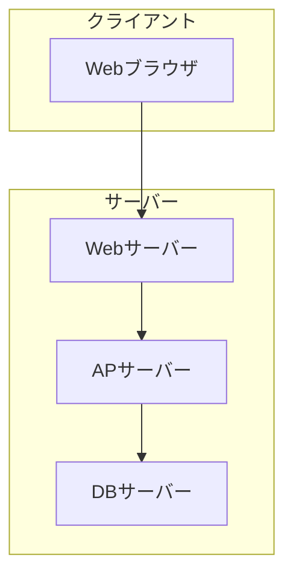
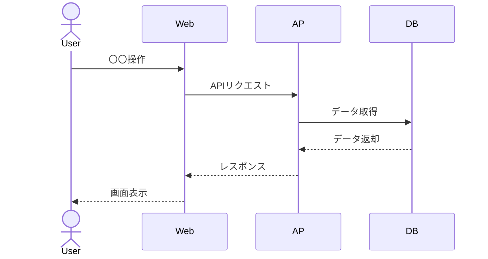

# 基本設計書テンプレート

このファイルは基本設計書を生成する際の構造ガイドライン。要件定義書が存在する場合は必ず参照し、トレーサビリティを確保する。

---

## 出力構成

```markdown
# 基本設計書

## 改訂履歴

| バージョン | 日付 | 変更内容 | 担当者 |
|-----------|------|---------|-------|
| 1.0 | YYYY-MM-DD | 初版作成 | TBD |

---

## 1. システム概要

### 1.1 システム構成図

（Mermaidで描く）



### 1.2 技術スタック

| 区分 | 技術 | バージョン | 備考 |
|-----|-----|---------|-----|
| フロントエンド | TBD | TBD | |
| バックエンド | TBD | TBD | |
| データベース | TBD | TBD | |
| インフラ | TBD | TBD | |

---

## 2. 機能一覧

要件定義書の機能要件との対応を明記する。

| 機能ID | 機能名 | 要件ID | 画面 | 概要 |
|-------|-------|-------|-----|-----|
| M-001 | 〇〇管理 | F-001 | SCR-001 | 〇〇のCRUD操作 |
| M-002 | △△処理 | F-002 | SCR-002 | △△を処理する |

---

## 3. 画面一覧

| 画面ID | 画面名 | 機能ID | 概要 |
|-------|-------|-------|-----|
| SCR-001 | 〇〇一覧画面 | M-001 | 〇〇の一覧を表示 |
| SCR-002 | 〇〇登録画面 | M-001 | 〇〇を新規登録 |
| SCR-003 | 〇〇詳細画面 | M-001 | 〇〇の詳細を表示・編集 |

---

## 4. データフロー

### 4.1 主要業務フロー

（Mermaidで描く）



---

## 5. インターフェース設計

### 5.1 外部システム連携

| IF-ID | 連携先 | 方式 | 方向 | 頻度 | 概要 |
|-------|-------|-----|-----|-----|-----|
| IF-001 | 〇〇システム | REST API | 送信 | リアルタイム | 〇〇データを送信 |
| IF-002 | △△システム | ファイル連携 | 受信 | 日次 | △△データを受信 |

### 5.2 バッチ処理

| バッチID | バッチ名 | 実行スケジュール | 概要 |
|---------|---------|--------------|-----|
| BAT-001 | 〇〇日次バッチ | 毎日0:00 | 〇〇データを集計 |

---

## 6. 非機能要件設計

### 6.1 性能設計
- キャッシュ戦略: 〇〇
- DBインデックス方針: 〇〇
- 負荷分散: 〇〇

### 6.2 セキュリティ設計
- 認証方式: 〇〇
- セッション管理: 〇〇
- CSRF対策: 〇〇
- XSS対策: 〇〇

### 6.3 ログ設計

| ログ種別 | 出力先 | 保持期間 | 出力内容 |
|---------|-------|---------|---------|
| アクセスログ | /var/log/access.log | 3ヶ月 | 日時・ユーザー・操作内容 |
| エラーログ | /var/log/error.log | 6ヶ月 | エラー詳細・スタックトレース |
| 監査ログ | /var/log/audit.log | 1年 | 重要操作の記録 |

---

## 7. エラーハンドリング方針

| エラー区分 | 対応方針 |
|---------|---------|
| 入力エラー | 画面にメッセージ表示、処理継続 |
| システムエラー | エラーログ出力、エラー画面表示 |
| 外部連携エラー | リトライ〇〇回、失敗時はアラート通知 |
```

---

## ヒアリング項目

基本設計書を作成する際に確認する項目：

**必須確認事項：**
1. どのような技術スタックを使うか？（または制約はあるか？）
2. 外部システムとの連携はあるか？
3. バッチ処理はあるか？
4. 画面数の概算は？
