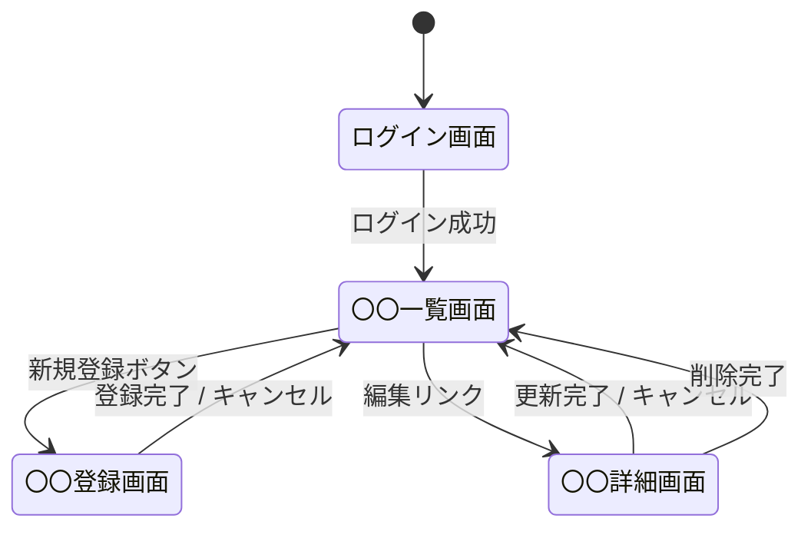

# 外部設計書テンプレート

このファイルは外部設計書（UI・インターフェース設計）を生成する際の構造ガイドライン。基本設計書の画面一覧・インターフェース一覧を参照して詳細化する。

---

## 出力構成

```markdown
# 外部設計書

## 改訂履歴

| バージョン | 日付 | 変更内容 | 担当者 |
|-----------|------|---------|-------|
| 1.0 | YYYY-MM-DD | 初版作成 | TBD |

---

## 1. 画面設計

### SCR-001: 〇〇一覧画面

#### 画面レイアウト

```
+--------------------------------------------------+
| [システム名]                    [ログアウト]      |
+--------------------------------------------------+
| ナビゲーション                                    |
+--------------------------------------------------+
| 〇〇一覧                         [新規登録]      |
|                                                  |
| 検索条件: [________] [▼カテゴリ] [検索]          |
|                                                  |
| ┌──┬──────┬──────┬──────┬────┐               |
| │No│〇〇名│区分  │更新日│操作│               |
| ├──┼──────┼──────┼──────┼────┤               |
| │1 │サンプル│A   │2024/1│編集│               |
| └──┴──────┴──────┴──────┴────┘               |
|                                                  |
| 1-10件 / 全50件  [<前へ] [次へ>]                |
+--------------------------------------------------+
```

#### 画面項目定義

| 項目ID | 項目名 | 種別 | 必須 | 最大文字数 | 入力制約 | 備考 |
|-------|-------|-----|-----|-----------|---------|-----|
| ITM-001 | 検索キーワード | テキスト | 任意 | 100 | - | 部分一致検索 |
| ITM-002 | カテゴリ | セレクト | 任意 | - | マスタ値 | 全て/〇〇/△△ |
| ITM-003 | 〇〇名 | ラベル | - | - | - | 一覧表示項目 |

#### アクション定義

| アクション | トリガー | 処理概要 | 遷移先 |
|---------|---------|---------|-------|
| 新規登録 | ボタンクリック | 登録画面へ遷移 | SCR-002 |
| 検索 | ボタンクリック | 検索条件で絞り込み | SCR-001（再描画） |
| 編集 | リンククリック | 詳細画面へ遷移 | SCR-003 |

#### バリデーション

| 項目 | チェック内容 | エラーメッセージ |
|-----|-----------|--------------|
| 検索キーワード | 最大100文字 | 「検索キーワードは100文字以内で入力してください」 |

---

### SCR-002: 〇〇登録画面

#### 画面レイアウト

```
+--------------------------------------------------+
| 〇〇登録                                         |
+--------------------------------------------------+
| 〇〇名 *    [________________________________]   |
|                                                  |
| カテゴリ *  [▼ 選択してください            ]    |
|                                                  |
| 説明        [________________________________]   |
|             [________________________________]   |
|                                                  |
|              [キャンセル]  [登録する]            |
+--------------------------------------------------+
```

（以降、各画面を同様の形式で記載）

---

## 2. 画面遷移図



---

## 3. メッセージ定義

### 3.1 入力チェックメッセージ

| メッセージID | 種別 | 内容 |
|------------|-----|-----|
| MSG-E-001 | エラー | 「〇〇は必須入力です」 |
| MSG-E-002 | エラー | 「〇〇は〇〇文字以内で入力してください」 |
| MSG-E-003 | エラー | 「〇〇の形式が正しくありません」 |

### 3.2 処理結果メッセージ

| メッセージID | 種別 | 内容 |
|------------|-----|-----|
| MSG-I-001 | 情報 | 「〇〇を登録しました」 |
| MSG-I-002 | 情報 | 「〇〇を更新しました」 |
| MSG-I-003 | 情報 | 「〇〇を削除しました」 |
| MSG-W-001 | 警告 | 「〇〇を削除しますか？この操作は取り消せません」 |

---

## 4. インターフェース仕様

### 4.1 API仕様（REST）

#### GET /api/v1/items - 〇〇一覧取得

**リクエスト**

| パラメータ | 型 | 必須 | 説明 |
|---------|---|-----|-----|
| keyword | string | 任意 | 検索キーワード |
| category | string | 任意 | カテゴリコード |
| page | integer | 任意 | ページ番号（デフォルト: 1） |
| limit | integer | 任意 | 取得件数（デフォルト: 10） |

**レスポンス（成功 200）**

```json
{
  "total": 50,
  "page": 1,
  "limit": 10,
  "items": [
    {
      "id": "string",
      "name": "string",
      "category": "string",
      "updatedAt": "2024-01-01T00:00:00Z"
    }
  ]
}
```

**エラーレスポンス**

| HTTPステータス | エラーコード | 説明 |
|-------------|-----------|-----|
| 400 | INVALID_PARAM | パラメータ不正 |
| 401 | UNAUTHORIZED | 認証エラー |
| 500 | INTERNAL_ERROR | サーバーエラー |

---

## 5. 帳票設計

### RPT-001: 〇〇レポート

| 項目 | 内容 |
|-----|-----|
| 帳票名 | 〇〇レポート |
| 出力形式 | PDF / Excel |
| 出力契機 | ユーザー操作 |
| 出力項目 | 〇〇、△△、□□ |
| ソート順 | 〇〇の昇順 |
```

---

## ヒアリング項目

外部設計書を作成する際に確認する項目：

**必須確認事項：**
1. 主要な画面は何か？（基本設計書の画面一覧を参照）
2. 各画面の主要な入力項目は何か？
3. 画面遷移のルールはあるか？
4. APIで外部システムと連携する仕様はあるか？
