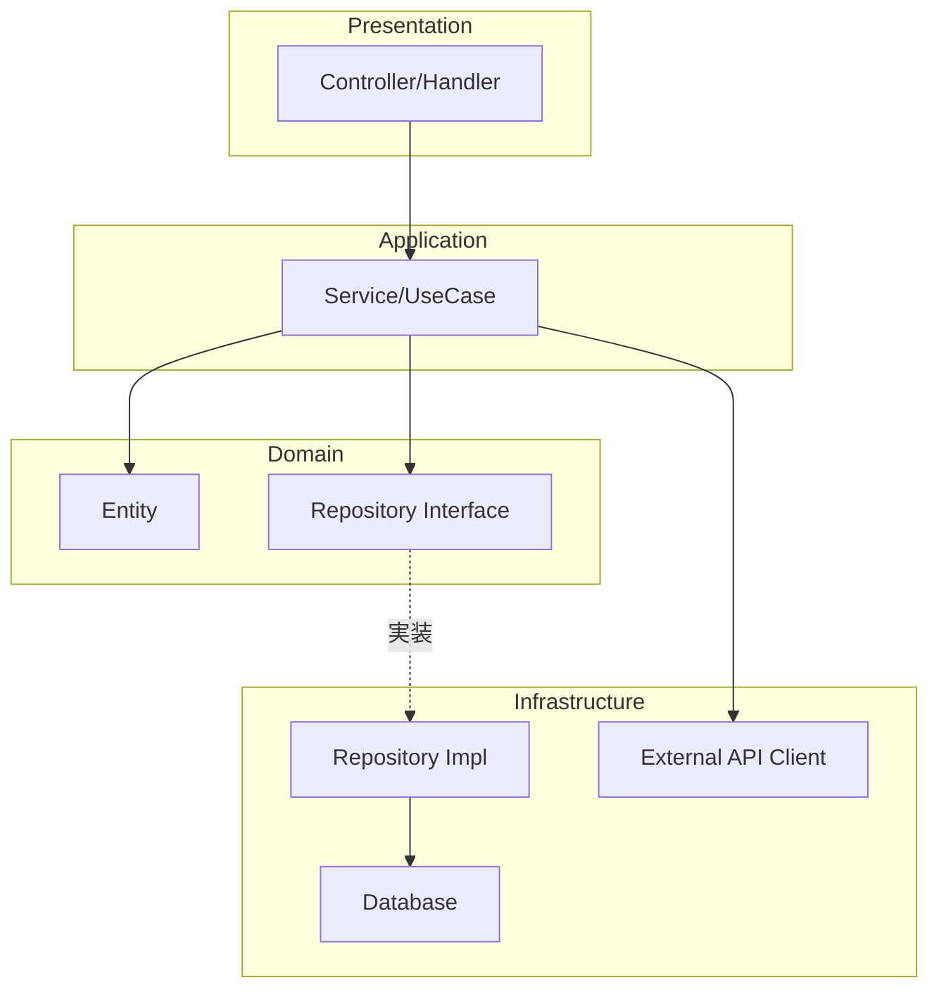
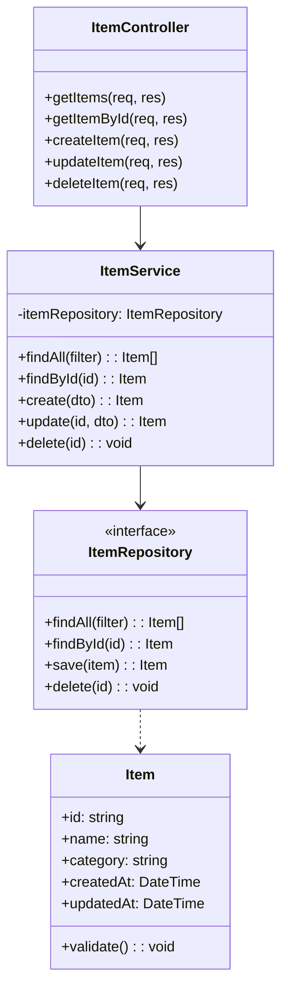
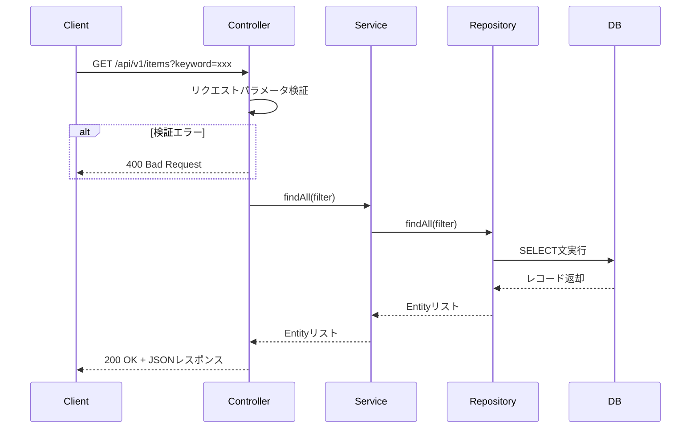
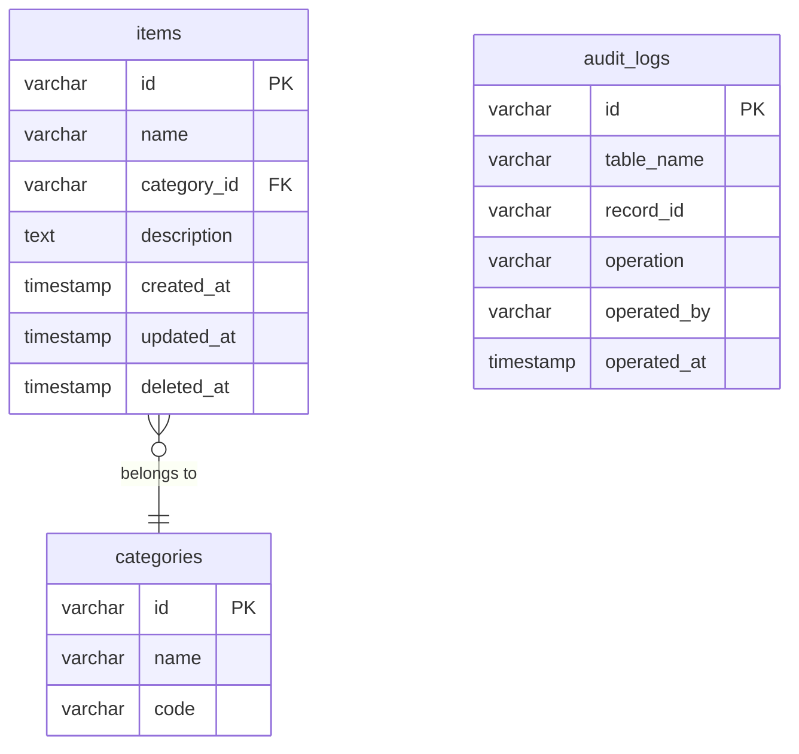

# 内部設計書テンプレート

このファイルは内部設計書（詳細設計）を生成する際の構造ガイドライン。外部設計書のAPI仕様・画面設計を参照して実装詳細を設計する。

---

## 出力構成

```markdown
# 内部設計書

## 改訂履歴

| バージョン | 日付 | 変更内容 | 担当者 |
|-----------|------|---------|-------|
| 1.0 | YYYY-MM-DD | 初版作成 | TBD |

---

## 1. アーキテクチャ概要

### 1.1 レイヤー構成



### 1.2 ディレクトリ構成

```
src/
├── controller/      # リクエスト受付・レスポンス返却
├── service/         # ビジネスロジック
├── domain/
│   ├── entity/      # ドメインモデル
│   └── repository/  # リポジトリインターフェース
├── infrastructure/
│   ├── repository/  # リポジトリ実装
│   └── client/      # 外部API呼び出し
└── config/          # 設定ファイル
```

---

## 2. クラス設計

### 2.1 クラス図



---

## 3. 処理フロー詳細

### 3.1 〇〇一覧取得処理



#### 処理手順

1. Controllerがリクエストを受け取り、クエリパラメータを取得する
2. パラメータのバリデーションを実行する
   - keywordが100文字以内であること
   - pageが1以上の整数であること
   - limitが1〜100の整数であること
3. Serviceの `findAll` メソッドを呼び出す
4. Repositoryを通じてDBからデータを取得する
5. 取得結果をレスポンスDTOに変換して返却する

---

## 4. データベース設計

### 4.1 テーブル一覧

| テーブル名 | 論理名 | 概要 |
|---------|-------|-----|
| items | 〇〇テーブル | 〇〇マスタ |
| categories | カテゴリテーブル | カテゴリマスタ |
| audit_logs | 監査ログテーブル | 操作履歴 |

### 4.2 テーブル定義

#### items テーブル

| カラム名 | 型 | 制約 | デフォルト | 説明 |
|--------|---|-----|---------|-----|
| id | VARCHAR(36) | PK, NOT NULL | UUID自動生成 | 主キー |
| name | VARCHAR(200) | NOT NULL | - | 〇〇名 |
| category_id | VARCHAR(36) | FK, NOT NULL | - | カテゴリID |
| description | TEXT | NULL | NULL | 説明 |
| created_by | VARCHAR(100) | NOT NULL | - | 作成者 |
| created_at | TIMESTAMP | NOT NULL | CURRENT_TIMESTAMP | 作成日時 |
| updated_by | VARCHAR(100) | NOT NULL | - | 更新者 |
| updated_at | TIMESTAMP | NOT NULL | CURRENT_TIMESTAMP | 更新日時 |
| deleted_at | TIMESTAMP | NULL | NULL | 論理削除日時 |

#### インデックス定義

| インデックス名 | カラム | 種別 | 目的 |
|------------|------|-----|-----|
| idx_items_category | category_id | 通常 | カテゴリ絞り込み高速化 |
| idx_items_name | name | 通常 | 名前検索高速化 |
| idx_items_deleted | deleted_at | 通常 | 論理削除絞り込み高速化 |

### 4.3 ER図



---

## 5. エラー処理設計

### 5.1 例外クラス定義

| 例外クラス | HTTPステータス | エラーコード | 説明 |
|----------|-------------|-----------|-----|
| ValidationException | 400 | VALIDATION_ERROR | 入力値検証エラー |
| NotFoundException | 404 | NOT_FOUND | データが存在しない |
| ConflictException | 409 | CONFLICT | データが重複している |
| InternalException | 500 | INTERNAL_ERROR | 予期しないエラー |

### 5.2 エラーレスポンス形式

```json
{
  "code": "VALIDATION_ERROR",
  "message": "入力値に誤りがあります",
  "details": [
    {
      "field": "name",
      "message": "名前は必須入力です"
    }
  ]
}
```

---

## 6. 設定値一覧

| 設定キー | デフォルト値 | 説明 |
|---------|-----------|-----|
| APP_PORT | 8080 | アプリケーションのポート番号 |
| DB_HOST | localhost | DBホスト |
| DB_PORT | 5432 | DBポート |
| DB_NAME | app_db | DB名 |
| JWT_SECRET | - | JWT署名キー（必須） |
| JWT_EXPIRY | 3600 | JWTの有効期限（秒） |
```

---

## ヒアリング項目

内部設計書を作成する際に確認する項目：

**必須確認事項：**
1. アーキテクチャパターンは何か？（レイヤードアーキテクチャ、クリーンアーキテクチャ等）
2. プログラミング言語・フレームワークは何か？
3. DBはリレーショナルDB？NoSQL？
4. 外部設計書のAPI仕様は確定しているか？
