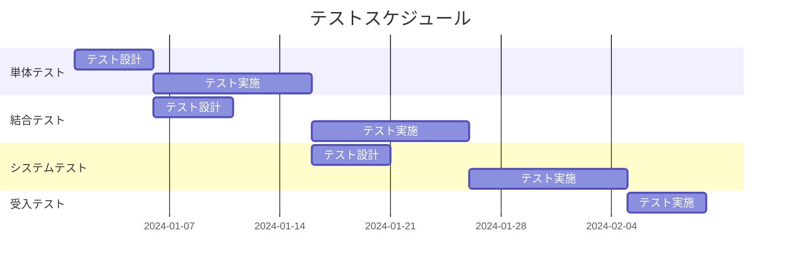

# 全体テスト計画書テンプレート

このファイルは全体テスト計画書を生成する際の構造ガイドライン。基本設計書のシステム概要・機能一覧を参照してテスト戦略を策定する。

---

## 出力構成

```markdown
# 全体テスト計画書

## 改訂履歴

| バージョン | 日付 | 変更内容 | 担当者 |
|-----------|------|---------|-------|
| 1.0 | YYYY-MM-DD | 初版作成 | TBD |

---

## 1. テスト方針

### 1.1 目的
本テスト計画書は、〇〇システムの品質を確保するためのテスト活動全体を定義する。
要件定義書で定義された要件および設計書に記載された仕様に対し、システムが正しく動作することを検証する。

### 1.2 テスト戦略
- **欠陥早期発見**: 各フェーズでテストを実施し、欠陥の早期発見・早期修正を行う
- **リスクベース**: リスクの高い領域を優先してテストを実施する
- **トレーサビリティ**: すべてのテストケースを要件・設計にトレースできるようにする

---

## 2. テストスコープ

### 2.1 テスト対象

| 対象 | 内容 |
|-----|-----|
| 機能テスト | 全機能（F-001〜F-XXX） |
| 性能テスト | レスポンスタイム・同時接続数 |
| セキュリティテスト | 認証・認可・入力値検証 |
| 互換性テスト | 対応ブラウザ |

### 2.2 テスト対象外

| 対象外 | 理由 |
|-------|-----|
| 〇〇システム（外部） | 外部システムの品質保証は対象外 |
| インフラ負荷テスト | 別途実施予定 |

---

## 3. テストフェーズ

| フェーズ | テスト種別 | 目的 | 担当 |
|---------|---------|-----|-----|
| Phase 1 | 単体テスト | 各モジュールの動作確認 | 開発者 |
| Phase 2 | 結合テスト | モジュール間の連携確認 | 開発者 |
| Phase 3 | システムテスト | システム全体の動作確認 | テスト担当 |
| Phase 4 | 受入テスト（UAT） | 業務要件への適合確認 | ユーザー |

---

## 4. テストスケジュール



---

## 5. 品質基準（合否判定基準）

### 5.1 テスト完了基準

| フェーズ | 基準 |
|---------|-----|
| 単体テスト | テストケース消化率100%、バグ解消率100% |
| 結合テスト | テストケース消化率100%、重大バグ0件 |
| システムテスト | テストケース消化率100%、重大・高バグ0件 |
| 受入テスト | ユーザー承認取得 |

### 5.2 バグ重要度定義

| 重要度 | 定義 | 対応方針 |
|-------|-----|---------|
| 重大 | システムが使用不能になる | 即時修正・再テスト必須 |
| 高 | 主要機能が正常動作しない | 次リリースまでに修正 |
| 中 | 機能が一部動作しない | 計画的に修正 |
| 低 | 軽微な表示崩れ等 | 余裕があれば修正 |

---

## 6. テスト環境

| 環境 | 用途 | 概要 |
|-----|-----|-----|
| 開発環境 | 単体テスト | 開発者ローカル環境 |
| テスト環境 | 結合・システムテスト | 本番と同等構成 |
| 受入環境 | 受入テスト | ユーザー確認用 |

---

## 7. テストツール

| 種別 | ツール | 用途 |
|-----|-------|-----|
| 単体テスト | TBD | 自動テスト実行 |
| APIテスト | Postman / TBD | API動作確認 |
| 負荷テスト | JMeter / TBD | 性能確認 |
| バグ管理 | TBD | 課題管理 |

---

## 8. リスクと対応策

| リスク | 影響 | 対応策 |
|-------|-----|-------|
| テスト期間の短縮 | 品質低下 | 優先度の高い機能から着手 |
| 環境構築の遅延 | テスト開始遅延 | 早期に環境準備を着手する |
| 仕様変更 | テストケースの大幅見直し | 変更影響の早期評価 |
```

---

## ヒアリング項目

全体テスト計画書を作成する際に確認する項目：

**必須確認事項：**
1. リリース目標日はいつか？
2. テスト担当者は誰か？（開発者 or 専任テスター）
3. 受入テストはユーザーが行うか？
4. 性能要件（レスポンスタイム・同時接続数）はあるか？
