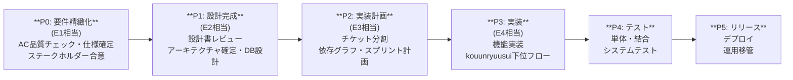
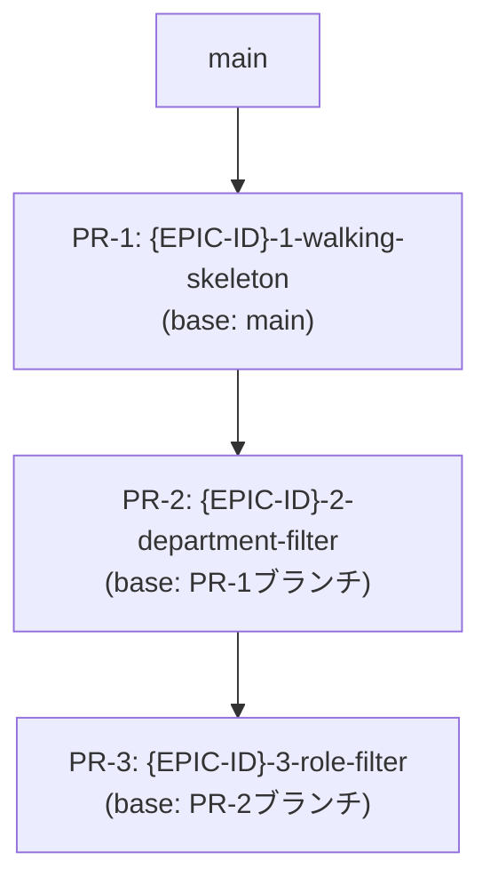

# spec-to-plan $ARGUMENTS

要件・仕様を起点に、**設計方針策定 → ドキュメント生成（sier-dev） → WBS作成**を一気通貫で行う統合プランニングスキル。
kouunryuusui の上位フロー（E1〜E3）のエッセンスを取り込み、実装フェーズに直結する計画を生成する。

## 出力ドキュメント体系

```
docs/
├── 00_design-policy/
│   ├── 設計方針書.md          ← このスキルが生成
│   └── decisions/             ← 主要アーキテクチャ判断の DR
│       └── DR-001-xxx.md
├── 01_requirements/
│   └── 要件定義書.md          ← sier-dev が生成
├── 02_basic-design/
│   └── 基本設計書.md          ← sier-dev が生成
├── 03_external-design/        ← 必要に応じて sier-dev が生成
├── 04_internal-design/        ← 必要に応じて sier-dev が生成
└── 06_wbs/
    ├── WBS.md                 ← このスキルが生成
    └── ticket-drafts/         ← このスキルが生成（Step 4b）
        ├── TICKET-001-xxx.md  ← 1チケット1ファイル
        └── TICKET-002-yyy.md
```

---

## 実行フロー

### Step 1: 要件収集・規模感の把握

ユーザーの入力から要件の状態を判定する：

| 状況 | アクション |
|------|-----------|
| テキスト・メモ程度 | 本スキル内でヒアリングを行い要件を整理する |
| 既存の仕様書・チケットあり | その内容を読み込んでStep 2へ |
| 要求が口頭・曖昧な段階 | `software-requirements` スキルを先に呼び出して要求整理後にStep 2へ |

**変更タイプ判定**（本番への影響を最初に把握する）：

| タイプ | 判定基準 | 設計への影響 |
|--------|---------|------------|
| **Greenfield（新規）** | 既存の本番ユーザーに影響しない新機能・新サービス | 本番影響戦略のセクションは省略可 |
| **Brownfield（既存変更）** | 本番稼働中の機能・DB・APIを変更する | Step 2 で **本番影響戦略を必ず策定**する |

Brownfield の場合、変更の種類に応じて以下の戦略を選択し設計方針書に記載する：

| 変更の種類 | 推奨戦略 | 参照スキル |
|-----------|---------|-----------|
| 機能追加・変更 | Feature Flag（段階有効化 → フラグ削除） | `feature-flag-strategy` |
| DB スキーマ変更 | Expand & Contract（後方互換を保った段階変更） | `data-model-designer` |
| API 破壊的変更 | バージョニング（旧エンドポイント並行稼働） | — |
| UI 大幅変更 | Feature Flag + カナリア比率制御 | `feature-flag-strategy` |
| インフラ移行 | Blue/Green デプロイ | — |

> 複数の変更種類が混在する場合は、それぞれに戦略を割り当てる。「Feature Flag + Expand & Contract」の組み合わせが最も多い。

---

**Tier判定**（kouunryuusui E1の「タスク性質判定」を流用）：

| Tier | 判定基準 | WBSへの影響 |
|------|---------|------------|
| **Tier 1** | CRUD・設定変更・既知パターン。変更ファイル3未満 | WBSをシンプルに。設計フェーズは軽量 |
| **Tier 2** | 複数コンポーネント・UI・分岐多い。変更ファイル3〜15 | WBSは標準構成。設計フェーズに投資 |
| **Tier 3** | 既存統合深い・パフォーマンス・ドメイン知識必要。変更ファイル15+以上 | WBSは詳細版。段階的スコープ切り出しを推奨 |

Tierと要件の把握ができたら `docs/00_design-policy/` ディレクトリを作成し、以下のStepへ進む。

---

### Step 2: 設計方針策定

要件を分析し、**設計方針書**を生成する。設計方針書はすべての後続ドキュメント（sier-dev生成物・WBS）の判断軸となる。

**策定する内容（詳細テンプレートは `references/design-policy-template.md` 参照）：**

1. **アーキテクチャスタイル** — モノリス/マイクロサービス/サーバーレス/BFF等
2. **技術スタック方針** — 言語・フレームワーク・インフラの選定理由
3. **データモデル方針** — DB種別、スキーマ設計思想、E&C適用有無
4. **API/インターフェース方針** — REST/GraphQL/gRPC、バージョニング
5. **セキュリティ方針** — 認証・認可・データ保護の基本方針
6. **スコープとスコープ外** — 今回やること・やらないことの明示
7. **本番影響戦略** — **Brownfield 変更の場合は必須**。Feature Flag / Expand & Contract / API バージョニング / Blue/Green のどれをどの変更に使うか。ロールバック手順と段階公開スケジュールも含める（テンプレートのセクション 8 参照）

**重要な判断にはDecision Recordを残す**（kouunryuusui DR形式）：

主要アーキテクチャ選択（DB選定・アーキテクチャスタイル・認証方式など）には、
`docs/00_design-policy/decisions/DR-NNN-タイトル.md` を作成する。
DR フォーマットは `references/dr-format.md` を参照。

設計方針書を `docs/00_design-policy/設計方針書.md` に保存する。

---

### Step 3: sier-dev でドキュメント生成

`sier-dev` スキルを呼び出し、Tier と設計方針に基づいてドキュメントを生成する。

| Tier | 生成するドキュメント |
|------|-------------------|
| Tier 1 | 要件定義書 + 基本設計書 |
| Tier 2 | 要件定義書 + 基本設計書 + 外部設計書 |
| Tier 3 | 要件定義書 + 基本設計書 + 外部設計書 + 内部設計書 |

```
# sier-dev スキル呼び出しの指示例
Skill(sier-dev)
# 入力: docs/00_design-policy/設計方針書.md の内容を渡し、
#       要件定義書から順に生成させる
```

**生成順序は上から**（依存関係があるため必ず順番通りに）：
1. 要件定義書
2. 基本設計書（要件定義書を参照）
3. 外部設計書（基本設計書を参照）— Tier 2/3 のみ
4. 内部設計書（外部設計書を参照）— Tier 3 のみ

各ドキュメントの生成後、設計方針書と矛盾がないか確認する。
矛盾があれば設計方針書を更新し、Decision Record を追記する。

---

### Step 4: WBS作成とチケットドラフト生成

kouunryuusui の上位フロー（E1〜E3）の構造を参考に、実装に直結するWBSとチケットドラフトを生成する。

#### Step 4a: WBS フェーズ構成を作成

**WBSフェーズ構成**（mermaid.js で記述する）：



WBSを `docs/06_wbs/WBS.md` に保存する（テンプレートは `references/wbs-template.md` 参照）。

**Tier別のWBS詳細度**：
- Tier 1: P0〜P2を合計1〜2日で計画、P3の実装チケットは3件以下
- Tier 2: P0〜P2をそれぞれ0.5〜2日、P3は10件前後のチケット
- Tier 3: P0〜P2をそれぞれ1〜5日、P3は段階的スコープ（MVPから拡張）

#### Step 4b: P3 タスクをチケットドラフト化

WBS の P3（実装）タスクを、`refine-ticket` が受け取れる形式の **T0-ready ドラフト** として生成する。

**チケットの切り方（3V原則）**：

各チケットは以下の **3V** を意識して切る：

| V | 意味 | NG例 | OK例 |
|---|------|------|------|
| **Valuable** | 1チケット = 1ユーザー価値。層別（BE/FE）ではなく「〜ができる」単位 | 「BE APIを実装する」 | 「名前で検索できる」 |
| **Vertical** | DB→BE→FEのエンドツーエンドを1チケットに含める（`vertical-slice` スキル参照） | DB実装チケット + FE実装チケットを別々に切る | 検索機能1本（DB+BE+FEを一体化） |
| **Verifiable** | ACが機械判定できる表現。DONE/NOT DONE が明確 | 「正しく動く」 | 「HTTPステータス200が返る」 |

> **例外**: 変更量が大きすぎる（目安: PR 300行超）場合は 3V を無視して層ごとに切ってよい。その際はチケット間の依存関係を明記し、Stacked PR として積む（Step 4c 参照）。

**なぜ WBS生成時点でドラフトを書くか**：  
設計方針書・sier-dev ドキュメントが揃っているこのタイミングが、ユーザー価値・優先度・依存関係を最も正確に書ける瞬間。コードベースを見る前に書けない Examples/異常系 AC は意図的に空けておき、kouunryuusui T0 の `refine-ticket` に委ねる。

**WBS生成時に書くもの（設計書から導ける）**：
- ユーザー価値・開発者価値（要件定義書・設計方針書から）
- 4軸スコアリングによる優先度（P0〜P3）
- Tier（規模感）と日数見積
- 依存チケット（実装順序・ブロッカー）
- draft AC の Given/When（前提条件と操作）

**T0（refine-ticket）に委ねるもの**：
- Then 句の具体値・機械判定可能な表現
- Examples（境界値・異常系の具体データ）
- 影響範囲調査（コードベース grep が必要）
- 業務フロー整合性確認（Tier 2/3）

各チケットドラフトは `docs/06_wbs/ticket-drafts/TICKET-NNN-xxx.md` として保存する。  
フォーマットは `references/ticket-draft-template.md` を参照。

**命名規則**:
```
TICKET-001-{機能を表す動詞句-ケバブケース}.md
例: TICKET-001-implement-user-auth.md
    TICKET-002-create-product-list-api.md
```

---

#### Step 4c: Stacked PR 戦略の決定

P3 チケット間に**実装順の依存がある場合**（Tier 2/3 で頻発）、PR の積み方を設計してチケットドラフトに記載する。

**いつ Stacked PR を使うか**:
- 3本以上の PR が順番に依存する場合
- vertical-slice のスライスが逐次依存する場合
- feature-flag-strategy の Add → BE → FE → Enable → Remove の5PR構成

**Stacked PR の基本構成**（チケットドラフトの「PR構成」セクションに mermaid で記載する）：



**ブランチ命名規則**:
```
feature/{EPIC-ID}-1-{short-name}   ← base: main
feature/{EPIC-ID}-2-{short-name}   ← base: feature/{EPIC-ID}-1-xxx
feature/{EPIC-ID}-3-{short-name}   ← base: feature/{EPIC-ID}-2-xxx
```

**PR 作成コマンド**:
```bash
# PR-1（base: main）
gh pr create --base main --title "[{EPIC-ID}-1] ..." --body "..."

# PR-2（base: PR-1 のブランチ）
gh pr create --base feature/{EPIC-ID}-1-{short} --title "[{EPIC-ID}-2] ..." \
  --body "Stacked on #{PR-1番号}"
```

**親 PR マージ後の rebase 手順**:
```bash
# PR-1 がマージされた後、PR-2 を main に付け替える
git checkout feature/{EPIC-ID}-2-{short}
git rebase --onto main feature/{EPIC-ID}-1-{short}
git push --force-with-lease
gh pr edit {PR-2番号} --base main
```

**親 PR に修正が入った時（force-push 後）は上から順に全 PR を rebase する**:
```bash
git checkout feature/{EPIC-ID}-2-{short}
git rebase feature/{EPIC-ID}-1-{short}
git push --force-with-lease

git checkout feature/{EPIC-ID}-3-{short}
git rebase feature/{EPIC-ID}-2-{short}
git push --force-with-lease
```

> **詳細手順・アンチパターン・ツール（Graphite / spr）は `stacked-pr` スキルを参照**（`Skill(stacked-pr)` で呼び出す）。スタックの深さが 6 本を超えそうなら `vertical-slice` で並列可能なスライスに分割することを先に検討する。

---

### Step 5: 完成報告と次のアクション

```
✅ 設計方針書         → docs/00_design-policy/設計方針書.md
✅ 要件定義書         → docs/01_requirements/要件定義書.md
✅ 基本設計書         → docs/02_basic-design/基本設計書.md
✅ WBS               → docs/06_wbs/WBS.md
✅ チケットドラフト群  → docs/06_wbs/ticket-drafts/ (N件)

次のアクション：
1. WBSのP0（要件精緻化）から着手
2. ticket-drafts/ の内容をチケット管理システム（Jira/Linear等）に起票
   ├── 優先度 P0/P1 のチケットを先に起票・アサイン
   └── 各ドラフトの「T0で補完が必要な項目」は起票後に refine-ticket で埋める
3. 実装フェーズ（P3）に入る際は /kouunryuusui を使って自律実行
   └── kouunryuusui T0 が自動的に refine-ticket を呼び出しドラフトを完成させる
```

---

## kouunryuusui との連携

このスキルで生成したドキュメントは、kouunryuusui の起点として直接使用できる：

| このスキルの成果物 | kouunryuusui での扱い |
|-----------------|---------------------|
| `docs/01_requirements/要件定義書.md` | E1の仕様書ソース（`spec-draft.md` の入力） |
| `docs/02_basic-design/基本設計書.md` | E2の設計文書（`design.md` の雛形） |
| `docs/06_wbs/WBS.md` | E3の`ticket-plan.md` に変換して使用 |
| `docs/06_wbs/ticket-drafts/` | **T0で `refine-ticket` に渡す入力ファイル群**。ユーザー価値・優先度・draft AC が記入済みのため、T0の所要時間が短縮される |
| `docs/00_design-policy/decisions/` | kouunryuusui の Decision Record として継承 |

**チケットドラフトと refine-ticket の役割分担**：

```
spec-to-plan が書く               refine-ticket（kouunryuusui T0）が補完する
─────────────────────────         ─────────────────────────────────────────
ユーザー価値・開発者価値   →       Examples（境界値・具体値）
4軸スコア（優先度 P0〜P3） →       異常系 AC の具体的表現
Tier・依存関係・見積       →       影響範囲調査（コードベース grep）
draft GWT（Given/When）   →       Then 句の機械判定可能な記述
                                   業務フロー整合性確認（Tier 2/3）
```

kouunryuusui を呼び出す際は、生成済みドキュメントの場所を伝えること：
```
/kouunryuusui EPIC-xxx
# → T0 で ticket-drafts/TICKET-NNN-xxx.md を読み込み、refine-ticket に渡す
```

---

## Gotchas（ハマりやすいポイント）

- **設計方針書を飛ばさない**: 後からドキュメント間の矛盾が増える。Tier 1 でも1ページの方針書は書く
- **Tier判定はWBSの詳細度に直結する**: Tier 3 で Tier 1 相当のWBSを作ると実装フェーズで手戻りが発生する
- **sier-dev の依存順を守る**: 要件定義書なしに基本設計書を作ると整合性が取れなくなる
- **WBSのP3はチケット名レベルに分解する**: 「実装」という一言だけのタスクは kouunryuusui が受け取れない
- **Decision Record は「なぜ他の案を採らなかったか」が必須**: 後で同じ議論を繰り返さないための仕組み
- **チケットドラフトに Examples を書かない**: コードベースを見る前に書いた具体値は実装フェーズで必ず覆る。意図的に空けて T0 に委ねる
- **draft AC の Then 句は「機械判定できない」状態でよい**: 「正しく表示される」程度でよい。refine-ticket が具体化する
- **優先度スコアは提案。最終判断は人間**: refine-ticket の原則と同じく、P0〜P3 の判定は PM/PO が承認する
- **Brownfield 変更で本番影響戦略を後回しにしない**: 「とりあえず実装してからリリース方法を考える」は最悪のパターン。実装後にロールバック手段がなくなり、メンテナンス時間帯での一括切り替えを強いられる。**Step 1 の変更タイプ判定で Brownfield と分かった時点で、Step 2 の設計方針書に戦略を必ず記入する**
- **Feature Flag を使うなら削除チケットを同時に作る**: フラグを追加した瞬間に削除チケット（TICKET-NNN-remove-flag）を P3 のドラフトに含める。後回しにすると永続フラグになり技術的負債になる
- **Expand & Contract を飛ばして DB を一発変更しない**: 本番稼働中のテーブルに対して破壊的なマイグレーションを実行すると旧バージョンのアプリが落ちる。必ず「Add（旧列残す）→ Migrate → Drop」の3段階で進める（`data-model-designer` スキル参照）
- **段階公開スケジュールの完了条件を曖昧にしない**: 「問題なければ本番へ」ではなく「エラー率 X% 以下かつレイテンシ p95 Y ms 以下を Z 時間継続」と数値で決める。曖昧だとカナリアを解除するタイミングで毎回議論になる

---

## 参照ファイル

- `references/design-policy-template.md` — 設計方針書のテンプレート
- `references/wbs-template.md` — WBS の詳細テンプレート（Tier別）
- `references/dr-format.md` — Decision Record フォーマット（kouunryuusui 準拠）
- `references/ticket-draft-template.md` — チケットドラフトのテンプレート（refine-ticket 互換）
