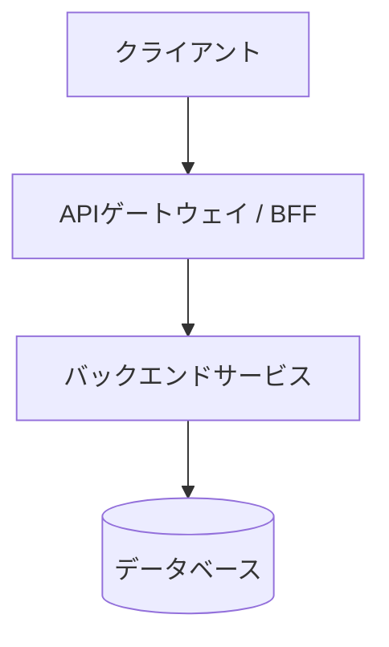

# 設計方針書テンプレート

SKILL.md の Step 2 で使用するテンプレート。
このテンプレートをベースに `docs/00_design-policy/設計方針書.md` を生成する。

---

```markdown
# 設計方針書
**プロジェクト名**: {プロジェクト名}
**作成日**: {YYYY-MM-DD}
**Tier**: {1 / 2 / 3}（規模感の判定）
**バージョン**: 1.0

---

## 1. プロジェクト概要

{2〜3文で何を作るかを記述。ビジネス的な価値と技術的な目標を含める}

## 2. スコープ

**スコープ内（今回作るもの）**:
- {機能・コンポーネント}
- ...

**スコープ外（今回やらないこと）**:
- {明示的に除外するもの}
- ...

> **なぜスコープを明示するか**: スコープ外を言語化しておかないと実装フェーズで「あれもやる？」という判断コストが発生する。

## 3. アーキテクチャスタイル

**採用するスタイル**: {モノリス / モジュラーモノリス / マイクロサービス / サーバーレス / BFF+SPA 等}

**選定理由**:
- {理由1}
- {理由2}

**構成概要**（Mermaid）:



## 4. 技術スタック方針

| レイヤー | 技術選定 | 選定理由 |
|---------|---------|---------|
| フロントエンド | {技術名} | {理由} |
| バックエンド | {技術名} | {理由} |
| データベース | {技術名} | {理由} |
| インフラ | {技術名} | {理由} |
| 認証 | {技術名} | {理由} |

## 5. データモデル方針

**DB種別**: {RDB / NoSQL / 併用}

**スキーマ設計思想**:
- {正規化方針}
- {Expand & Contract 適用の有無}（既存DBがある場合）
- {マイグレーション方針}

**主要エンティティ**:
- {エンティティ1}: {役割}
- {エンティティ2}: {役割}

## 6. API / インターフェース方針

**スタイル**: {REST / GraphQL / gRPC / tRPC 等}

**設計原則**:
- {バージョニング方針：URLパス v1/ など}
- {エラーレスポンス統一形式}
- {認証方式：Bearer Token / Cookie / API Key 等}

## 7. セキュリティ方針

- **認証**: {JWT / OAuth2 / セッション等}
- **認可**: {RBAC / ABAC / リソースオーナーチェック等}
- **データ保護**: {暗号化対象・保存方針}
- **入力バリデーション**: {バリデーション層の配置}

## 8. 非機能要件の方針

| 観点 | 目標値 / 方針 |
|------|------------|
| パフォーマンス | {例: APIレスポンス p95 < 500ms} |
| 可用性 | {例: 99.9% / 月} |
| スケーラビリティ | {例: 水平スケール対応 / 固定スケール} |
| 監視・ロギング | {ツール名・ログ戦略} |

## 9. 主要な判断と Decision Record

以下の判断については `decisions/` ディレクトリに DR を作成した。

| DR番号 | タイトル | 判断の概要 |
|--------|---------|----------|
| DR-001 | {タイトル} | {一行の判断概要} |
| DR-002 | ... | ... |

## 10. 制約と前提条件

- **技術的制約**: {既存システム・言語・ライブラリの制約}
- **業務的制約**: {期日・予算・チーム規模}
- **法的制約**: {GDPR・個人情報保護法等}

---

*この設計方針書は sier-dev が生成するドキュメント群と WBS の判断軸となる。変更は Decision Record で記録すること。*
```
